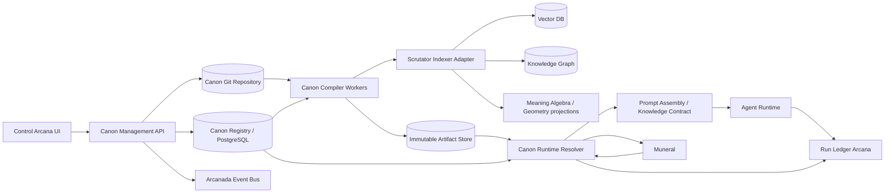

# Техническое задание
## Canon Arcana и Canon Management в Control Arcana

**Версия:** 0.1  
**Статус:** implementation draft  
**Назначение:** документ для декомпозиции и передачи агентам разработки  
**Экосистема:** Arcanada  

---

## 0. Принятые архитектурные решения

Ниже перечислены решения, которые должны считаться обязательными для первой реализации.

1. **Git-репозиторий Canon Arcana является источником истины для исходных и утверждённых канонических артефактов.** База данных Control Arcana хранит реестр, индексы, статусы, задачи сборки и кэш, но не заменяет Git как authoritative source.
2. **Обязательный Canon не ищется обычным векторным поиском.** Он детерминированно разрешается по точным идентификаторам пользователя, агента и структурного пространства: Universe → Galaxy → Space → Project → Module. Векторный и графовый поиск используются для авторинга, дедупликации, поиска дополнительных знаний, объяснения связей и retrieval-слоя.
3. **Скомпилированный Canon является неизменяемым артефактом.** Каждый пакет имеет `release_id`, digest, исходный Git commit, версию компилятора и Resolution Receipt.
4. **Scrutator является производным индексом, но не источником истины.** Потеря или рассинхронизация векторного либо графового индекса не должна менять содержание обязательного контекста.
5. **Muneral не хранит тексты Canon.** Он хранит координаты scope и ссылку на закреплённый `canon_snapshot_id`/digest для конкретного Work Item или запуска.
6. **Нельзя предварительно компилировать декартово произведение всех пользователей и проектов.** Структурные пакеты и пользовательские overlays компилируются отдельно; финальный Context Snapshot собирается детерминированно и кэшируется при запуске.
7. **LLM может участвовать в переводе, нормализации, сжатии и семантической проверке только до публикации.** Во время обычного runtime-вызова агента обязательный контекст не должен заново пересказываться моделью.
8. **Производственная активация должна быть атомарной.** Новый release становится активным только после успешной сборки, проверки, размещения артефактов и обязательных этапов индексации.
9. **Агенты не получают прямой доступ к рабочей копии Git-репозитория Canon.** Runtime-доступ осуществляется через Canon Resolver/API по логическому URI и digest.
10. **Любое изменение Canon имеет provenance.** Должны быть известны автор, причина, целевой scope, Work Item/issue, commit, проверяющий и издатель.

---

# 1. Цель системы

Создать в экосистеме Arcanada управляемую систему хранения, редактирования, наследования, компиляции, публикации, поиска и применения канонических знаний и правил.

Система должна позволять:

- хранить уставы, цели, миссии, определения, политики, правила, ограничения и базовые знания на разных уровнях абстракции;
- редактировать их как из глобального раздела **Canon Management**, так и непосредственно из карточки пользователя, Universe, Galaxy, Space, Project или Module;
- автоматически переводить и нормализовать исходные материалы в компактный английский canonical form;
- формировать воспроизводимые пакеты для агентов;
- наследовать правила от верхних уровней к нижним;
- применять персональные, командные и агентские overlays;
- обнаруживать конфликты, дублирование, незаконное ослабление правил и потерю смысла;
- индексировать опубликованные артефакты в Scrutator: vector index, knowledge graph и последующие представления Meaning Algebra/Meaning Geometry;
- детерминированно выдавать каждому запуску агента правильную версию Canon;
- фиксировать точную версию Canon в Run Ledger и Work Item;
- откатывать активную версию без изменения уже состоявшихся исторических запусков.

---

# 2. Границы ответственности

## 2.1. Canon Arcana отвечает за

- исходные канонические документы;
- их идентификацию и версионность;
- нормализованные английские clauses;
- наследование и разрешение конфликтов;
- компиляцию scope packs;
- публикацию releases;
- runtime resolution;
- source mapping и Resolution Receipt;
- API управления и получения Canon;
- интеграцию с Scrutator;
- выдачу immutable Context Snapshot.

## 2.2. Control Arcana отвечает за

- пользовательский интерфейс;
- Scope Registry либо интеграцию с общим Scope Registry;
- права доступа и роли операторов;
- запуск workflow редактирования, проверки, сборки, публикации и отката;
- отображение состояния Git, compiler jobs, releases и индексации;
- просмотр resolved Canon на уровне конкретного объекта;
- аудит действий оператора.

## 2.3. Muneral отвечает только за

- передачу координат scope для Work Item;
- запрос Context Snapshot перед запуском;
- закрепление `canon_snapshot_id` и digest;
- наследование snapshot подзадачами, если scope не изменился;
- повторное разрешение Canon при явном изменении scope или принудительном rebase;
- остановку или re-resolution при отзыве критического release.

Muneral **не должен**:

- компилировать Canon;
- хранить полный текст Canon;
- самостоятельно выбирать правила через semantic search;
- считать последнюю версию Canon эквивалентной версии, закреплённой за уже начатым запуском.

## 2.4. Scrutator отвечает за

- полнотекстовый и векторный поиск;
- графовые связи;
- поиск похожих и потенциально дублирующихся clauses;
- retrieval дополнительных знаний;
- построение версионированных семантических представлений;
- поиск объяснений и источников;
- impact analysis по графу зависимостей.

Scrutator **не должен** быть единственным способом получить обязательный Canon.

## 2.5. Prompt Assembly / Knowledge Contract Resolver отвечает за

- включение `mandatory_context.en.md` в контекст исполнения;
- подключение активированных conditional clauses;
- выдачу агенту инструментов для retrieval-слоя;
- фиксацию ссылок на Canon в Knowledge Contract и Prompt Assembly Receipt.

## 2.6. Run Ledger Arcana отвечает за

- запись `snapshot_id`, digest, release IDs и compiler version;
- связь между контекстом и действиями агента;
- возможность воспроизвести использованный Canon спустя время.

---

# 3. Термины

| Термин | Значение |
|---|---|
| **Canon Artifact** | Один версионируемый источник канонического смысла: charter, policy, rule, definition и т. п. |
| **Canonical Clause** | Атомарное английское утверждение с модальностью `MUST`, `MUST NOT`, `SHOULD`, `MAY`, `DEFINES` и стабильным ID. |
| **Scope** | Область действия Canon. |
| **Structural Scope** | Universe, Galaxy, Space, Project, Module. |
| **Actor Overlay** | Organization, Team, User, Agent. |
| **Execution Context** | Work Item, phase, action, tools, capabilities, environment. |
| **Scope Pack** | Скомпилированные артефакты одного scope. |
| **Resolved Structural Pack** | Пакет structural scope с учётом его предков и импортов. |
| **Overlay Pack** | Пакет организации, команды, пользователя или агента. |
| **Context Snapshot** | Финальный неизменяемый Canon конкретного запуска после объединения structural pack, overlays и conditional rules. |
| **Canon Release** | Опубликованная версия scope pack с version, digest и source commit. |
| **Resolution Receipt** | Машиночитаемое объяснение того, какие источники вошли, были объединены, исключены, заменены или вызвали конфликт. |
| **Active Pointer** | Атомарная ссылка на активный release для конкретного scope, environment и profile. |
| **Retrieval Layer** | Дополнительные знания, которые не входят в обязательный prompt и извлекаются через Scrutator. |

---

# 4. Модель областей действия

## 4.1. Структурная иерархия

```text
Universe
└── Galaxy
    └── Space
        └── Project
            └── Module (optional)
```

Каждый structural scope обязан иметь не более одного structural parent. Повторно используемые правила подключаются через explicit imports/packs, а не через множественное наследование.

## 4.2. Иерархия субъекта

```text
Organization
└── Team
    └── User
        └── Agent
```

Actor Overlay не является потомком Project. Один пользователь может работать одновременно в нескольких проектах и пространствах.

## 4.3. Контекст исполнения

```text
Work Item
└── Phase
    └── Action / Tool invocation
```

Execution Context не хранится как постоянный структурный Canon, но участвует в активации conditional clauses.

## 4.4. Порядок разрешения

Финальный Context Snapshot строится в следующем порядке:

```text
Platform hard policies (если существуют)
+ Universe
+ Galaxy
+ Space
+ Project
+ Module
+ Organization overlay
+ Team overlay
+ User overlay
+ Agent overlay
+ Work Item conditions
+ Phase/action/tool conditions
= Context Snapshot
```

Этот порядок не означает, что нижний уровень всегда может отменить верхний. Возможность замены определяется `merge_strategy`, `authority`, `strength` и `overridable` конкретного clause.

## 4.5. Стратегии объединения

Минимально поддержать следующие стратегии:

- `accumulate` — все утверждения сохраняются;
- `nearest` — действует ближайшее более специфичное значение;
- `tighten_only` — нижний scope может только усилить ограничение;
- `deny_overrides` — любой применимый запрет сильнее разрешения;
- `union` — объединение множеств;
- `intersection` — пересечение разрешённых множеств;
- `explicit_replace` — замена разрешена только через `supersedes`;
- `locked` — переопределение запрещено.

Рекомендуемые значения по умолчанию:

| Вид артефакта | Стратегия по умолчанию |
|---|---|
| Policy / Constraint | `accumulate` или `tighten_only` |
| Permission | `deny_overrides` |
| Default / Preference | `nearest` |
| Definition | `locked` либо `explicit_replace` |
| Goal / Mission | `accumulate` |
| Allowed tools / capabilities | `intersection` |
| Tags / audiences | `union` |

Неразрешимый конфликт должен останавливать сборку. Silent fallback запрещён.

---

# 5. Архитектура компонентов



## 5.1. Canon Git Repository

Хранит:

- source Markdown;
- approved canonical English clauses;
- frontmatter и schema-controlled metadata;
- тестовые сценарии;
- controlled vocabulary;
- merge policies;
- CODEOWNERS;
- историю изменений.

Не хранит:

- секреты;
- runtime state;
- очереди сборки;
- transient compiler logs;
- embeddings;
- незашифрованные персональные данные, не предназначенные для Canon.

## 5.2. Scope Registry

Должен существовать единый реестр scope IDs, общий для Control Arcana, Canon Arcana и Muneral.

Рекомендуемый владелец: backend Control Arcana или отдельный Platform Registry.

Путь папки в Git является удобным отображением, но не authoritative identity. Истинный идентификатор хранится во frontmatter и Scope Registry.

## 5.3. Canon Management API

Осуществляет:

- CRUD drafts/proposals;
- работу с Git branch/commit/PR;
- валидацию;
- запуск compilation jobs;
- review/approval/publish/rollback;
- запрос active releases;
- preview resolved context;
- управление reindex;
- RBAC и аудит.

## 5.4. Canon Compiler

Рекомендуется реализовать как Rust library + CLI + worker service:

```text
canon-core
canon-compiler
canon-resolver
canon-api
arcana canon ...
```

CLI и сервер должны использовать одну и ту же библиотеку разрешения, чтобы результат локальной проверки совпадал с production.

## 5.5. Canon Registry

Рекомендуемое хранилище: PostgreSQL.

Registry хранит метаданные, статусы и связи, но не заменяет Git и object store.

## 5.6. Immutable Artifact Store

Рекомендуется S3-compatible storage: MinIO/S3 или существующий Arcanada artifact storage.

Содержимое адресуется по digest. Изменение объекта после публикации запрещено.

## 5.7. Canon Runtime Resolver

Read-optimized сервис, который:

- принимает точные coordinates;
- получает active либо pinned releases;
- соединяет structural pack и overlays;
- активирует conditional clauses;
- проверяет конфликты и ACL;
- формирует либо находит кэшированный snapshot;
- возвращает английский компактный context, manifest и receipt.

## 5.8. Scrutator Indexer Adapter

Плагин/worker, преобразующий release в набор операций для:

- vector store;
- graph store;
- full-text index;
- Meaning Algebra projector;
- Meaning Geometry projector.

Каждый projector должен иметь собственную версию и статус.

---

# 6. Размещение системы

## 6.1. Рекомендуемая схема

Исходный Git-репозиторий, Canon Registry, compiler workers, artifact store и Scrutator Adapter размещаются на **сервере знаний** либо в доверенном внутреннем контуре рядом со Scrutator.

Production agents не монтируют этот Git-репозиторий и не читают mutable branch напрямую. Они обращаются к Canon Runtime Resolver.

Control Arcana может находиться на другом сервере и работать через API.

## 6.2. Причины

- знания и их производные находятся в одном защищённом контуре;
- проще проводить атомарную индексацию;
- не требуется выдавать агентам Git credentials;
- immutable packs можно кэшировать на production nodes;
- source repository не зависит от жизненного цикла одного runtime-сервера;
- позднее можно перейти к федерации нескольких Canon repositories.

## 6.3. Логические URI

Вместо прямых путей вида `/srv/repositories/...` использовать:

```text
canon://artifact/<artifact_id>@<version>
canon://release/<release_id>
canon://pack/<digest>
canon://snapshot/<snapshot_id>
```

Control Arcana дополнительно может показывать человеку Git blob/commit link. Агенту выдаётся logical URI и digest.

---

# 7. Модель данных

## 7.1. Scope

Минимальные поля:

```yaml
id: scope.project.muneral
kind: structural
scope_type: project
slug: muneral
name: Muneral Arcana
parent_scope_id: scope.space.agent-execution
tenant_id: arcanada
status: active
repository_path: universes/arcanada/.../projects/muneral
owner_principal_id: user.pavel
created_at: timestamp
updated_at: timestamp
```

## 7.2. CanonArtifact

```yaml
id: canon.policy.external-actions.provenance
scope_id: scope.universe.arcanada
kind: policy
title: External Action Provenance
status: draft|review|active|deprecated|superseded|revoked
source_language: ru
canonical_language: en
file_path: ...
git_commit: ...
semantic_version: 1.2.0
strength: must
overridable: false
merge_strategy: tighten_only
activation_mode: always
visibility: internal
owner_principal_id: ...
reviewer_principal_ids: []
effective_from: null
effective_to: null
content_hash: ...
```

## 7.3. CanonicalClause

```yaml
id: clause.external-action.provenance.required
artifact_id: canon.policy.external-actions.provenance
canonical_en: Every external side effect MUST be recorded in the Provenance Journal.
modality: MUST
subject: agent_or_orchestrator
action: record
object: external_side_effect
conditions: []
exceptions: []
strength: hard
merge_strategy: tighten_only
locked: true
source_spans:
  - artifact_id: canon.policy.external-actions.provenance
    section: Required meaning
    start_line: 34
    end_line: 39
semantic_fingerprint: ...
```

## 7.4. CanonRelease

```yaml
id: rel_01...
target_scope_id: scope.project.muneral
profile: agent-core
environment: production
version: 2.3.0
status: candidate|staged|active|deprecated|revoked|failed
source_commit: 8d71...
compiler_version: 0.1.0
parent_release_ids: []
overlay_release_ids: []
manifest_uri: canon://release/rel_01.../manifest
pack_uri: canon://pack/sha256:...
pack_digest: sha256:...
token_count: 1840
created_by: ...
approved_by: ...
published_at: ...
```

## 7.5. CompileJob

Поля:

- job ID;
- target scope;
- source commit;
- profile;
- environment;
- dry-run flag;
- include descendants flag;
- requested by;
- status;
- stage;
- diagnostics;
- impact report URI;
- output release ID;
- timestamps;
- correlation ID.

## 7.6. IndexJob

Отдельный статус для каждого projection:

```yaml
release_id: rel_01...
projection: fulltext|vector|graph|meaning_algebra|meaning_geometry
projection_version: ...
status: queued|running|ready|failed|stale
indexed_digest: sha256:...
error: null
```

## 7.7. ContextSnapshot

```yaml
id: ctx_01...
tenant_id: arcanada
structural_scope_chain: []
actor_overlay_chain: []
work_item_id: wi_...
phase: implementation
tools: [git, shell]
profile: agent-core
source_release_ids: []
pack_digest: sha256:...
context_uri: canon://snapshot/ctx_01.../context
manifest_uri: canon://snapshot/ctx_01.../manifest
resolution_receipt_uri: canon://snapshot/ctx_01.../receipt
token_count: 2120
created_at: ...
revocation_status: valid
```

## 7.8. Waiver / Exception

Явное исключение должно содержать:

- policy/clause ID;
- scope;
- основание;
- authorizing principal;
- срок действия;
- affected release;
- risk classification;
- provenance link.

Неявная отмена родительского правила запрещена.

---

# 8. Формат исходного Markdown

Минимальный пример:

```markdown
---
id: canon.policy.external-actions.provenance
scope_id: scope.universe.arcanada
kind: policy
status: active
version: 1.0.0
source_language: ru
canonical_language: en
strength: must
merge_strategy: tighten_only
overridable: false
activation:
  mode: always
visibility: internal
owner: user.pavel
---

# Журналирование внешних действий

## Source

Любое действие агента, изменяющее внешний мир, должно быть
зафиксировано в журнале происхождения и действий.

## Canonical clauses

- `clause.external-action.provenance.required` — Every external side effect MUST be recorded in the Provenance Journal.
- `clause.external-action.authorization.required` — The record MUST identify the acting principal, intent, authorization, target, result, timestamp, and rollback reference when available.

## Rationale

...

## Required meaning

...

## Counterexamples

...

## Tests

- An unlogged `git push` MUST be rejected.
- A read-only repository inspection MAY proceed without an external-side-effect record.
```

Для drafts допускается отсутствие утверждённых canonical clauses. Такой artifact не может попасть в production release.

---

# 9. Canon Management в Control Arcana

## 9.1. Глобальный раздел меню

Добавить пункт:

```text
Canon Management
```

Внутри должны быть следующие экраны.

### A. Overview

Показывает:

- число active releases;
- drafts и proposals;
- scopes с source changes, но без нового release;
- stale packs;
- compilation failures;
- index lag Scrutator;
- unresolved conflicts;
- token budgets и самые тяжёлые packs;
- последние публикации и откаты;
- releases, используемые активными runs.

### B. Scope Explorer

Древовидное представление:

```text
Universe
  Galaxy
    Space
      Project
        Module
```

Отдельные ветви/фильтры:

- Organizations;
- Teams;
- Users;
- Agents;
- Shared packs;
- Proposals.

Для каждого узла показывать:

- active release;
- source commit;
- количество локальных и унаследованных artifacts;
- build/index status;
- stale indicator;
- token count;
- descendants affected by pending changes.

### C. Artifact Browser

Фильтры:

- scope;
- kind;
- status;
- language;
- owner;
- strength;
- activation mode;
- visibility;
- changed since release;
- conflict/dedup warnings.

### D. Artifact Editor

Должен поддерживать:

- Markdown editor;
- structured frontmatter form;
- source/canonical English side-by-side;
- список extracted clauses;
- source mapping;
- preview diff;
- references/graph links;
- inherited constraints;
- duplicate suggestions из Scrutator;
- validation errors в строках;
- counterexamples/tests;
- commit message и provenance reason;
- создание proposal вместо прямого изменения.

### E. Resolved Canon Preview

Позволяет выбрать:

- structural scope;
- organization/team/user/agent;
- Work Item type;
- phase;
- tools/actions;
- environment;
- profile;
- active или конкретные pinned releases.

Показывает:

- финальный английский context;
- token count;
- источник каждого clause;
- почему clause включён;
- чем и где он был переопределён;
- исключённые conditional rules;
- конфликты;
- Resolution Receipt;
- режим **Preview as Agent**.

### F. Compilation

Действия:

- `Validate`;
- `Compile Preview`;
- `Create Snapshot`;
- `Build Candidate`;
- `Publish`;
- `Rebuild descendants`;
- `Re-index Scrutator`;
- `Cancel job`;
- `Download/View artifacts`;
- `Compare with active`.

Параметры:

- target scope;
- source commit/branch;
- profile;
- environment;
- include descendants;
- strict indexing mode;
- token budget;
- compile reason.

### G. Releases

Показывает:

- release history;
- versions;
- source commits;
- compiler versions;
- digests;
- approvals;
- active pointers;
- dependent scopes;
- usage by runs;
- semantic diff;
- rollback/promotion/revocation.

### H. Scrutator Sync

Показывает по каждому release:

- full-text status;
- vector status;
- graph status;
- Meaning Algebra status/version;
- Meaning Geometry status/version;
- количество upserts/deletes;
- index lag;
- ошибки;
- reindex actions.

### I. Proposals Inbox

Для новых идей и агентских предложений:

- source text;
- suggested target scope;
- suggested artifact kind;
- найденные дубли;
- proposed canonical clauses;
- impact preview;
- accept/edit/reject;
- связь с Work Item, conversation, issue или external source.

## 9.2. Встроенная вкладка Canon в объектах Control Arcana

На страницах Universe, Galaxy, Space, Project, Module, User и Agent добавить вкладку **Canon**.

Минимальные блоки:

1. Charter данного объекта.
2. Local artifacts.
3. Inherited Canon.
4. Active release и source commit.
5. Состояние compilation/indexing.
6. Кнопка `Add Canon Artifact`.
7. Кнопка `Compile Preview`.
8. Кнопка `Publish` при наличии прав.
9. `Preview as Agent`.
10. `Open in Canon Management`.
11. История изменений.
12. Список дочерних scopes, требующих rebuild.

Inherited locked clauses отображаются read-only с указанием источника.

## 9.3. Статусы интерфейса

Поддержать единый набор состояний:

```text
Draft
Changed
Validating
Invalid
Ready for review
In review
Approved
Building
Staged
Indexing
Active
Stale
Deprecated
Revoked
Failed
```

---

# 10. Workflow изменения Canon

## 10.1. Быстрое добавление идеи

1. Пользователь или агент нажимает `Add Canon Artifact` либо отправляет proposal через API.
2. Указывает target scope, исходный текст, язык, причину и provenance reference.
3. Система предлагает kind, title, canonical clauses и похожие существующие artifacts.
4. Proposal сохраняется как draft и не влияет на агентов.
5. Editor/reviewer корректирует текст.
6. Выполняются schema, conflict, duplicate и semantic coverage checks.
7. Изменение сохраняется в Git branch/commit.
8. После review merge попадает в reviewed source.
9. Release собирается и публикуется отдельно.

## 10.2. Git workflow

Рекомендуемый процесс:

```text
UI draft / agent proposal
→ canon/<scope>/<change-id> branch
→ commits
→ validation checks
→ review / pull request
→ merge to main
→ candidate build
→ staging index
→ approval
→ publish release/tag
→ atomic active pointer switch
```

Прямой push в protected production branch запрещён.

Direct Git edits допустимы. Webhook должен синхронизировать Registry и запускать validation/impact analysis.

## 10.3. Автосохранение

UI может хранить незавершённый текст в draft storage. Git commit создаётся при явном `Save Version`, `Submit for review` либо с настраиваемой периодичностью. Autosave не должен засорять основную историю Git тысячами мелких commits.

## 10.4. Agent-authored changes

По умолчанию агент имеет право создавать только proposal/draft.

Для публикации требуются:

- checker validation;
- approval уполномоченного principal;
- соответствие CODEOWNERS;
- успешный candidate build;
- отсутствие unresolved hard conflicts.

---

# 11. Compiler pipeline

## 11.1. Стадии

Compiler обязан выполнять следующие стадии:

1. Checkout exact source commit.
2. Parse Markdown и frontmatter.
3. Validate JSON Schema и controlled vocabulary.
4. Validate stable IDs, parent relations и references.
5. Detect cycles и invalid imports.
6. Extract/validate canonical English clauses.
7. При необходимости создать proposal перевода/нормализации, но не публиковать его автоматически.
8. Validate modality, conditions, exceptions и merge strategy.
9. Resolve structural inheritance.
10. Apply explicit imports.
11. Detect exact duplicates.
12. Detect semantic near-duplicates через Scrutator/semantic checker.
13. Detect contradictions и forbidden weakening.
14. Apply supersedes/waivers.
15. Compile activation expressions.
16. Deduplicate clauses с сохранением source map.
17. Compress wording без потери обязательных qualifiers.
18. Validate semantic coverage.
19. Run counterexamples и scenario tests.
20. Enforce token budget.
21. Generate human-readable context.
22. Generate machine-readable clauses.
23. Generate manifest, source map, semantic diff, impact report и Resolution Receipt.
24. Calculate digest и optionally sign artifacts.
25. Upload candidate to immutable artifact store.
26. Trigger staged Scrutator projections.
27. Verify projections.
28. Mark candidate ready for publication.

## 11.2. Два уровня компиляции

### Authoring compilation

Использует LLM и semantic tools для:

- перевода;
- извлечения clauses;
- сжатия;
- поиска дубликатов;
- атакующей проверки;
- генерации counterexamples.

Результат требует review.

### Deterministic release/runtime compilation

Не должен заново перефразировать смысл моделью. Он использует утверждённые clauses и детерминированно выполняет inheritance, activation, filtering, ordering и packaging.

## 11.3. Проверка сохранения смысла

Обязательные требования:

- каждый active `MUST`/`MUST NOT` source statement имеет mapping хотя бы в один output clause;
- output clause имеет обратные ссылки на источники;
- отрицания, исключения, пороги, последовательность и temporal conditions не могут исчезнуть;
- объединение нескольких clauses допускается только при сохранении source map;
- новый output clause не должен добавлять более сильное правило без источника;
- hard coverage ratio должен быть 100%;
- semantic checker и adversarial checker должны быть раздельными ролями;
- unresolved loss-of-meaning warning блокирует production publication.

## 11.4. Token budget

Token budget задаётся по profile и scope.

Compiler должен:

- показывать вклад каждого scope;
- сообщать compression ratio;
- запрещать молча удалять mandatory clauses;
- переносить rationale/examples в retrieval layer;
- при превышении hard budget завершать сборку ошибкой либо требовать explicit waiver;
- сохранять расширенный pack даже при наличии компактного runtime context.

Рекомендуемые profiles:

- `agent-core` — только mandatory always-on clauses;
- `agent-standard` — core + активированные conditional clauses;
- `agent-extended` — standard + компактные retrieval hints;
- `human-review` — полный текст, rationale, sources и explanations;
- `indexing` — представление для Scrutator.

## 11.5. Impact analysis

Изменение верхнего scope должно определять затронутые descendants.

Compiler/Registry создаёт список:

- scopes requiring rebuild;
- releases becoming stale;
- snapshots unaffected because they are immutable;
- active long-running Work Items using previous release;
- possible breaking changes.

Rebuild выполняется инкрементально и идемпотентно.

---

# 12. Формат compiled pack

Рекомендуемая структура immutable release artifact:

```text
canon-pack.tar.zst
├── mandatory_context.en.md
├── clauses.jsonl
├── conditional_clauses.jsonl
├── retrieval_manifest.json
├── manifest.json
├── source_map.json
├── resolution_receipt.json
├── semantic_diff.json
├── impact_report.json
├── graph_delta.json
├── search_documents.jsonl
└── signature.sig               # optional in MVP
```

## 12.1. manifest.json

Минимальный пример:

```json
{
  "schema_version": "1.0",
  "release_id": "rel_01J...",
  "target_scope_id": "scope.project.muneral",
  "profile": "agent-core",
  "environment": "production",
  "version": "2.3.0",
  "source_commit": "8d71...",
  "compiler_version": "0.1.0",
  "pack_digest": "sha256:...",
  "source_artifact_ids": [
    "canon.policy.external-actions.provenance@1.0.0"
  ],
  "parent_release_ids": [],
  "imports": [],
  "token_count": 1840,
  "created_at": "2026-09-09T12:00:00Z"
}
```

## 12.2. clauses.jsonl

Каждая строка содержит одну canonical clause, её activation metadata, merge result и source refs.

## 12.3. mandatory_context.en.md

Это наиболее компактный текст, который Prompt Assembly может непосредственно включить в системный контекст.

Он не обязан содержать длинные IDs рядом с каждым предложением. Связь текста с источниками хранится в `source_map.json`.

---

# 13. Release и публикация

## 13.1. Версии

Не смешивать три вида версий:

1. **Git commit** — точная версия source tree.
2. **Artifact semantic version** — версия конкретного Canon Artifact.
3. **Canon Release version** — версия compiled pack для scope/profile/environment.

Рекомендуемая semver-интерпретация release:

- `PATCH` — редакционное изменение без изменения обязанности/разрешения;
- `MINOR` — совместимое добавление смысла или нового правила;
- `MAJOR` — удаление, ослабление, несовместимая замена либо изменение поведения агентов.

## 13.2. Каналы

```text
draft → candidate → staged → active → deprecated → revoked
```

## 13.3. Атомарная публикация

Процесс:

1. Candidate pack строится из exact commit.
2. Pack загружается в immutable storage.
3. Scrutator индексирует candidate в staging namespace.
4. Выполняются integrity и query smoke tests.
5. Все mandatory projectors получают `ready`.
6. Оператор/политика подтверждает publish.
7. Active pointer переключается одной транзакцией.
8. Публикуется `canon.release.activated` event.
9. Runtime caches инвалидируются по release pointer, но старые snapshots остаются валидными.

Если обязательная индексация не удалась, предыдущий release остаётся active.

## 13.4. Rollback

Rollback не пересобирает старый pack. Он атомарно возвращает active pointer на ранее опубликованный release.

Уже выполненные и закреплённые snapshots не переписываются.

## 13.5. Revocation

Для критически опасного Canon release поддержать `revoked`.

При revocation:

- новые resolutions не используют release;
- активные Work Items получают событие;
- policy определяет: продолжить pinned run, остановить или принудительно re-resolve;
- Run Ledger сохраняет факт revocation и реакцию.

---

# 14. Интеграция со Scrutator

## 14.1. Что индексируется

Для каждого опубликованного release:

- source artifacts;
- canonical clauses;
- scope charters;
- compiled pack summary;
- definitions;
- policies;
- decisions;
- source maps;
- release metadata;
- semantic diff;
- relationships;
- retrieval-only content.

## 14.2. Графовые сущности

Минимальные node types:

```text
Scope
Artifact
Clause
Release
Pack
Definition
Policy
Decision
Constraint
Principal
WorkItem (reference only)
```

Минимальные edge types:

```text
PARENT_OF
BELONGS_TO
INHERITS_FROM
IMPORTS
OVERRIDES
SUPERSEDES
CONFLICTS_WITH
DEFINES
REQUIRES
APPLIES_TO
DERIVED_FROM
COMPILED_INTO
ACTIVE_FOR
USED_BY
AUTHORED_BY
APPROVED_BY
```

## 14.3. Векторный индекс

Рекомендуется создавать embeddings отдельно для:

- source chunks;
- canonical clauses;
- charters;
- retrieval documents;
- release summaries.

Каждая запись обязана содержать filters:

- tenant ID;
- scope ID;
- ancestor scope IDs;
- release ID;
- artifact/clause ID;
- visibility;
- status;
- language;
- activation mode;
- effective dates;
- ACL principals/roles;
- embedding model/version;
- source digest.

## 14.4. Meaning Algebra / Meaning Geometry

Эти представления считаются derived projections.

Требования:

- projector имеет `projector_name` и `projector_version`;
- результат привязан к clause IDs и release digest;
- обновление инкрементально по changed clauses;
- должна поддерживаться полная пересборка;
- изменение модели/геометрии не меняет source Canon;
- runtime mandatory context не зависит от доступности экспериментального projector;
- Control Arcana показывает, какой semantic projection использован.

## 14.5. Инкрементальная индексация

Indexer получает `graph_delta.json` и `search_documents.jsonl`.

Он должен выполнять:

- idempotent upsert;
- tombstone/deactivate для удалённых или deprecated entities;
- versioned edges;
- staging namespace;
- verification queries;
- promotion staging → active;
- retry с тем же correlation ID без дублирования.

## 14.6. Retrieval для агентов

Semantic search разрешён только с обязательными фильтрами:

- tenant;
- authorized scopes;
- active либо pinned release IDs;
- visibility/ACL;
- compatible environment;
- effective date;
- разрешённый activation layer.

Результат поиска возвращает:

- logical Canon URI;
- artifact/clause ID;
- release ID;
- digest;
- scope;
- source provenance;
- reason/ranking;
- fetch endpoint.

Агент извлекает артефакт через Canon API, а не по mutable filesystem path.

---

# 15. Runtime resolution для агента

## 15.1. Входной Execution Envelope

```json
{
  "tenant_id": "arcanada",
  "actor": {
    "organization_id": "org.arcanada",
    "team_ids": ["team.core"],
    "user_id": "user.pavel",
    "agent_id": "agent.developer.17"
  },
  "structural_scope": {
    "universe_id": "scope.universe.arcanada",
    "galaxy_id": "scope.galaxy.core",
    "space_id": "scope.space.agent-execution",
    "project_id": "scope.project.muneral",
    "module_id": "scope.module.resolver"
  },
  "execution": {
    "work_item_id": "wi_01J...",
    "work_item_type": "software_change",
    "phase": "implementation",
    "tools": ["git", "shell", "postgres"],
    "actions": ["read", "write", "test"]
  },
  "environment": "production",
  "profile": "agent-standard",
  "release_policy": {
    "mode": "active"
  }
}
```

## 15.2. Алгоритм

1. Проверить tenant и actor authorization.
2. Проверить, что structural IDs образуют допустимую цепочку.
3. Получить active/pinned structural releases.
4. Получить разрешённые actor overlay releases.
5. Применить imports.
6. Отфильтровать clauses по environment/effective dates.
7. Активировать conditional clauses по work type, phase, tools и actions.
8. Применить merge strategies и waivers.
9. Завершить ошибкой при hard conflict.
10. Построить cache key из release IDs и activation fingerprint.
11. Вернуть существующий immutable snapshot либо создать новый.
12. Передать snapshot в Prompt Assembly.
13. Записать usage event в Run Ledger.

## 15.3. Ответ Resolver

```json
{
  "snapshot_id": "ctx_01J...",
  "pack_digest": "sha256:...",
  "context_en": "...",
  "context_uri": "canon://snapshot/ctx_01J.../context",
  "manifest_uri": "canon://snapshot/ctx_01J.../manifest",
  "resolution_receipt_uri": "canon://snapshot/ctx_01J.../receipt",
  "source_release_ids": ["rel_..."],
  "token_count": 2120,
  "warnings": []
}
```

## 15.4. Fail-closed policy

- Если mandatory release отсутствует, revoked, повреждён или digest не совпадает — запуск не начинается.
- Если optional retrieval index недоступен — агент может продолжить с mandatory snapshot, но получает warning.
- Resolver не должен угадывать scope по семантической близости.
- Fallback на parent разрешён только как явно настроенная policy и отражается в receipt.

## 15.5. Кэширование

Cache key включает:

```text
tenant
+ structural release IDs
+ overlay release IDs
+ profile
+ environment
+ activation fingerprint
+ compiler/resolver schema version
```

Recommended cache layers:

- in-process LRU;
- Redis/shared cache;
- immutable artifact store;
- optional edge cache для read-only context blobs.

---

# 16. Интеграция с Muneral

## 16.1. Поля Work Item

Добавить или стандартизировать:

```yaml
scope_ref:
  universe_id: ...
  galaxy_id: ...
  space_id: ...
  project_id: ...
  module_id: ...
actor_ref:
  organization_id: ...
  team_ids: []
  user_id: ...
canon_resolution_policy:
  mode: active_at_start|pinned|rebase_on_phase
canon_snapshot_id: null
canon_pack_digest: null
canon_resolved_at: null
```

## 16.2. Правила запуска

- Muneral обязан получить snapshot до передачи leaf node агенту.
- Parent Work Item может передать snapshot дочернему, если scope/actor/activation context совместимы.
- При изменении project/module, tools или action class выполняется новое resolution.
- По умолчанию long-running Work Item сохраняет pinned snapshot до завершения.
- Явное действие `Rebase Canon` создаёт новый snapshot и provenance record.

## 16.3. События

Muneral подписывается на:

- `canon.release.revoked`;
- `canon.scope.binding.changed`;
- `canon.policy.force_rebase`.

Muneral публикует:

- `workitem.canon.resolution.requested`;
- `workitem.canon.snapshot.pinned`;
- `workitem.canon.rebased`;
- `workitem.canon.blocked`.

---

# 17. API

API должен иметь OpenAPI specification и стабильную `/v1` версию.

## 17.1. Scopes

```text
GET    /v1/canon/scopes/tree
GET    /v1/canon/scopes/{scope_id}
POST   /v1/canon/scopes
PATCH  /v1/canon/scopes/{scope_id}
GET    /v1/canon/scopes/{scope_id}/impact
```

## 17.2. Artifacts и proposals

```text
GET    /v1/canon/artifacts
GET    /v1/canon/artifacts/{artifact_id}
POST   /v1/canon/artifacts
PATCH  /v1/canon/artifacts/{artifact_id}
POST   /v1/canon/artifacts/{artifact_id}/validate
POST   /v1/canon/artifacts/{artifact_id}/submit-review
POST   /v1/canon/proposals
GET    /v1/canon/proposals
POST   /v1/canon/proposals/{id}/accept
POST   /v1/canon/proposals/{id}/reject
```

## 17.3. Git operations

```text
POST   /v1/canon/git/commit
POST   /v1/canon/git/create-review
POST   /v1/canon/git/sync
GET    /v1/canon/git/status
GET    /v1/canon/git/diff
```

UI не должен вызывать shell/Git напрямую.

## 17.4. Compilation

```text
POST   /v1/canon/compilations
GET    /v1/canon/compilations/{job_id}
POST   /v1/canon/compilations/{job_id}/cancel
GET    /v1/canon/compilations/{job_id}/logs
GET    /v1/canon/compilations/{job_id}/artifacts
```

Пример запроса:

```json
{
  "target_scope_id": "scope.project.muneral",
  "source_commit": "8d71...",
  "profile": "agent-core",
  "environment": "production",
  "dry_run": true,
  "include_descendants": false,
  "strict_indexing": true,
  "reason": "Update project charter"
}
```

## 17.5. Releases

```text
GET    /v1/canon/releases
GET    /v1/canon/releases/{release_id}
POST   /v1/canon/releases/{release_id}/approve
POST   /v1/canon/releases/{release_id}/publish
POST   /v1/canon/releases/{release_id}/deprecate
POST   /v1/canon/releases/{release_id}/revoke
POST   /v1/canon/releases/{release_id}/rollback
GET    /v1/canon/releases/active
GET    /v1/canon/releases/{release_id}/diff
```

## 17.6. Runtime

```text
POST   /v1/canon/resolve
GET    /v1/canon/snapshots/{snapshot_id}
GET    /v1/canon/snapshots/{snapshot_id}/context
GET    /v1/canon/snapshots/{snapshot_id}/manifest
GET    /v1/canon/snapshots/{snapshot_id}/receipt
POST   /v1/canon/explain
```

## 17.7. Scrutator sync

```text
GET    /v1/canon/index-status/{release_id}
POST   /v1/canon/releases/{release_id}/reindex
POST   /v1/canon/releases/{release_id}/verify-index
```

---

# 18. Event contracts

Минимальный список событий:

```text
canon.source.changed
canon.proposal.created
canon.validation.completed
canon.validation.failed
canon.compile.requested
canon.compile.completed
canon.compile.failed
canon.release.candidate.created
canon.index.requested
canon.index.projection.ready
canon.index.failed
canon.release.activated
canon.release.rolled_back
canon.release.revoked
canon.scope.binding.changed
canon.snapshot.created
canon.snapshot.used
```

Обязательные поля envelope:

```json
{
  "event_id": "evt_...",
  "event_type": "canon.release.activated",
  "schema_version": "1.0",
  "occurred_at": "...",
  "tenant_id": "arcanada",
  "correlation_id": "...",
  "causation_id": "...",
  "actor_principal_id": "...",
  "scope_id": "...",
  "release_id": "...",
  "source_commit": "...",
  "pack_digest": "sha256:...",
  "payload": {}
}
```

Использовать transactional outbox, чтобы commit/publish и событие не расходились.

---

# 19. Права доступа и безопасность

## 19.1. Роли

Минимальные роли:

- `CanonViewer`;
- `CanonContributor`;
- `CanonEditor`;
- `CanonReviewer`;
- `CanonPublisher`;
- `CanonAdministrator`;
- `CanonRuntimeReader`;
- `CanonIndexer`.

Права должны быть scoped: пользователь может редактировать Project, но не Universe.

## 19.2. Правила

- Все production writes проходят через authenticated API.
- Git service account credentials находятся в Custodium Arcana.
- UI и агенты не получают raw credentials.
- Production branch защищён.
- Publication требует отдельного permission.
- Confidential user overlays не индексируются в shared tenant index без ACL filters.
- Cross-tenant resolution и retrieval запрещены.
- Pack digest проверяется при чтении.
- Все edit/review/publish/rollback/revoke действия журналируются.
- Canon не должен содержать секреты; допускаются только logical secret references/policies.
- HTML/Markdown rendering должен быть защищён от script injection.

## 19.3. Риск-классы изменений

Рекомендуемые классы:

- `editorial`;
- `operational`;
- `security`;
- `compliance`;
- `behavior-breaking`.

Security/compliance/behavior-breaking changes требуют усиленного approval policy.

---

# 20. Ошибки

Минимальные machine-readable codes:

```text
CANON_SCHEMA_INVALID
CANON_SCOPE_NOT_FOUND
CANON_SCOPE_CHAIN_INVALID
CANON_PARENT_CYCLE
CANON_REFERENCE_BROKEN
CANON_CANONICAL_EN_MISSING
CANON_LOCKED_OVERRIDE
CANON_FORBIDDEN_WEAKENING
CANON_UNRESOLVED_CONFLICT
CANON_MEANING_COVERAGE_GAP
CANON_TOKEN_BUDGET_EXCEEDED
CANON_SOURCE_COMMIT_STALE
CANON_PACK_DIGEST_MISMATCH
CANON_RELEASE_NOT_READY
CANON_RELEASE_REVOKED
CANON_INDEX_SYNC_FAILED
CANON_ACCESS_DENIED
CANON_RUNTIME_RESOLUTION_FAILED
```

Каждая ошибка должна иметь:

- code;
- human message;
- scope/artifact/clause refs;
- source location;
- remediation hint;
- correlation ID.

---

# 21. Observability

## 21.1. Метрики

- compile success/failure rate;
- compile duration;
- stage duration;
- number of artifacts/clauses;
- input/output token count;
- compression ratio;
- conflicts by type;
- stale scope count;
- descendant rebuild queue;
- index lag by projector;
- resolver latency p50/p95/p99;
- resolver cache hit rate;
- snapshot creation rate;
- active release age;
- pack fetch failures;
- revoked releases in active Work Items.

## 21.2. Логи и traces

Каждый workflow должен иметь единый correlation ID от UI action до Git commit, compiler, Scrutator, release activation, Muneral resolution и Run Ledger.

## 21.3. Целевые показатели MVP

- Cached resolve p95: не более 100 ms во внутренней сети.
- Cold resolve p95: не более 500 ms без LLM-вызова.
- Atomic publication: отсутствие периода, когда active pointer указывает на неполный pack.
- Idempotent retry всех build/index jobs.

Значения являются целевыми и могут быть уточнены после нагрузочных тестов.

---

# 22. Тестирование

## 22.1. Unit tests

- Markdown/frontmatter parsing;
- ID validation;
- inheritance;
- each merge strategy;
- activation expressions;
- supersedes/waivers;
- token counting;
- digest calculation;
- ACL filtering;
- cache key stability.

## 22.2. Integration tests

- UI/API → Git commit;
- Git webhook → Registry sync;
- commit → candidate build;
- build → artifact store;
- build → Scrutator staging index;
- staging → active pointer;
- resolver → Prompt Assembly;
- Muneral → snapshot pin;
- Run Ledger usage record;
- rollback/revocation.

## 22.3. Semantic tests

- source requirement preserved after compression;
- negation is not lost;
- exception is not generalized;
- threshold and ordering preserved;
- duplicate clauses merge correctly;
- conflicting MUST/MUST NOT blocks build;
- child scope cannot weaken locked universe policy;
- counterexample catches ambiguous compact wording.

## 22.4. Security tests

- project editor cannot edit universe;
- user overlay does not leak to another user;
- tenant isolation;
- unauthorized agent cannot fetch pack;
- revoked release cannot be newly resolved;
- Git/object store credentials are not exposed;
- malicious Markdown cannot execute script;
- search requires ACL filters.

## 22.5. Failure tests

- vector DB unavailable;
- graph DB unavailable;
- object store unavailable;
- compiler worker dies mid-job;
- duplicate event delivery;
- stale Git commit;
- digest mismatch;
- partial index failure;
- rollback during active runs.

---

# 23. Критерии приёмки MVP

## AC-001. Репозиторий

Создан private Canon repository с README, schemas, controlled language, примером Universe Charter, Project Charter, policy и user overlay.

## AC-002. Scope Registry

Universe, Galaxy, Space, Project, Module и actor overlays имеют стабильные IDs и могут быть выбраны в Control Arcana.

## AC-003. Embedded UI

В карточке Project доступна вкладка Canon с Charter, local/inherited artifacts, active release и compile preview.

## AC-004. Global UI

Работает Canon Management Explorer, Artifact Editor, Compilation, Releases и Scrutator Sync.

## AC-005. Git versioning

Изменение из UI создаёт commit/branch с автором, причиной и provenance. Direct Git change синхронизируется обратно.

## AC-006. Validation

Невалидный schema, broken reference, forbidden override и hard conflict блокируют candidate build.

## AC-007. Compilation

Project pack компилируется из Universe → Galaxy → Space → Project, содержит английский mandatory context, manifest, clauses, source map и receipt.

## AC-008. User overlay

Один и тот же Project для двух пользователей может вернуть разные snapshots без создания полного отдельного Project release на каждого пользователя.

## AC-009. Deterministic resolution

При одинаковом input envelope и одинаковых release IDs Resolver возвращает одинаковый digest.

## AC-010. No vector dependency for mandatory Canon

Отключение vector DB не меняет mandatory context и не мешает resolve существующих release packs.

## AC-011. Scrutator indexing

После publication canonical clauses и links доступны в vector и graph search с правильными scope/release/ACL filters.

## AC-012. Meaning projections

Архитектура допускает подключение Meaning Algebra/Geometry как versioned projectors; отсутствие projector не меняет source Canon.

## AC-013. Atomic activation

При сбое индексации новый release не становится active в strict production mode.

## AC-014. Muneral integration

Work Item получает и сохраняет `canon_snapshot_id` и digest до запуска агента.

## AC-015. Reproducibility

По записи Run Ledger можно получить exact snapshot, manifest, source releases и source commit.

## AC-016. Rollback

Оператор может переключить active pointer на предыдущий release; новые runs получают старый release, старые snapshots не меняются.

## AC-017. Security

Scope-based RBAC, tenant isolation и user-overlay ACL проходят тесты.

## AC-018. Explainability

Для каждого output clause UI показывает source artifact, scope, merge decision и reason for inclusion.

## AC-019. Token budget

UI показывает token count и вклад уровней; mandatory clauses не удаляются молча при превышении бюджета.

## AC-020. Agent proposal

Агент может создать proposal, но не может автоматически активировать Universe/Project policy без review и publish permission.

---

# 24. Декомпозиция реализации

## Epic 1. Canon domain model и schemas

- Scope IDs и taxonomy;
- artifact frontmatter schema;
- clause schema;
- release/manifest/receipt schemas;
- merge strategies;
- activation DSL;
- error codes.

## Epic 2. Canon repository bootstrap

- repository layout;
- README;
- CODEOWNERS;
- branch protection;
- CI lint;
- initial Arcanada Universe Charter;
- example Project/User artifacts.

## Epic 3. Compiler core

- parser;
- validator;
- inheritance resolver;
- conflict engine;
- deduplication;
- token budget;
- pack generator;
- digest/source map/receipt;
- CLI.

## Epic 4. Registry и Management API

- PostgreSQL migrations;
- scopes/artifacts/jobs/releases;
- Git integration;
- compile orchestration;
- publish/rollback/revoke;
- OpenAPI;
- RBAC/audit.

## Epic 5. Runtime Resolver

- execution envelope;
- active/pinned release lookup;
- overlay composition;
- conditional activation;
- snapshot generation;
- caching;
- fail-closed behavior;
- read API.

## Epic 6. Control Arcana UI

- global menu;
- explorer;
- editor;
- resolved preview;
- compiler jobs;
- releases;
- Scrutator status;
- embedded Canon tabs;
- proposal inbox.

## Epic 7. Scrutator Adapter

- indexing documents;
- graph delta;
- vector upserts;
- staging namespace;
- filters/ACL;
- incremental reindex;
- projector plugin interface.

## Epic 8. Muneral / Prompt Assembly / Run Ledger integration

- Work Item fields;
- resolve-before-run gate;
- snapshot pinning;
- propagation to subagents;
- Prompt Assembly inclusion;
- usage events;
- revocation handling.

## Epic 9. Security, observability и tests

- Custodium integration;
- metrics/traces;
- integration fixtures;
- semantic test suite;
- failure injection;
- load testing;
- documentation.

---

# 25. Рекомендуемый порядок MVP

## Phase 1. Deterministic core

1. Repository + schemas.
2. Scope Registry integration.
3. Rust compiler/CLI.
4. Project structural pack.
5. Immutable artifact storage.
6. Runtime Resolver.
7. Minimal Muneral snapshot pinning.

На этой фазе обязательный Canon уже должен безопасно применяться без Scrutator.

## Phase 2. Control Arcana management

1. Explorer.
2. Project Canon tab.
3. Editor.
4. Validation/compile preview.
5. Releases/publish/rollback.
6. RBAC/audit.

## Phase 3. Scrutator integration

1. Full-text/vector indexing.
2. Knowledge graph.
3. Search filters и ACL.
4. Duplicate/conflict assistance.
5. Staging index and atomic activation.

## Phase 4. Meaning layer и advanced semantics

1. Meaning Algebra projector.
2. Meaning Geometry projector.
3. Semantic diff.
4. Adversarial checker.
5. Automatic impact reasoning.
6. Multi-repository federation.

---

# 26. Definition of Done

Система считается реализованной в первой производственной версии, когда оператор может:

1. Открыть Project в Control Arcana.
2. Просмотреть его Charter, локальные и унаследованные каноны.
3. Добавить новую идею как proposal.
4. Отредактировать source и canonical English clauses.
5. Увидеть дубли, конфликты, token impact и affected descendants.
6. Создать Git commit и отправить изменение на review.
7. Собрать candidate pack.
8. Просмотреть resolved context глазами выбранного агента.
9. Опубликовать release после успешной индексации.
10. Запустить Work Item в Muneral.
11. Убедиться, что Work Item получил immutable Canon snapshot.
12. Найти дополнительные canonical artifacts через Scrutator с корректными ACL.
13. В Run Ledger увидеть digest и точные источники использованного Canon.
14. Откатить release без изменения истории уже состоявшихся запусков.

Главный критерий системы:

> Любой агент получает не приблизительно найденный набор документов, а точный, проверяемый и воспроизводимый Canon своей среды; при этом расширенные знания остаются доступны через Scrutator, а изменение любого смысла имеет Git-историю, source mapping и provenance.
