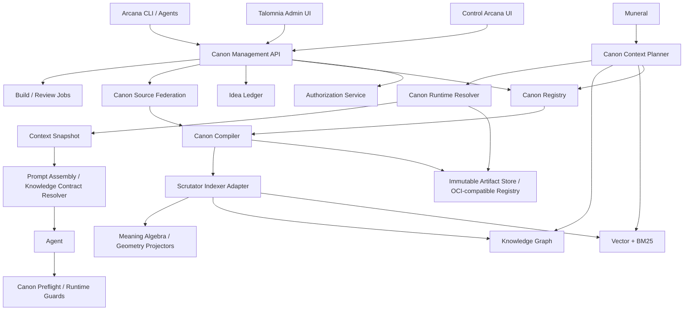

# Техническое задание
## Canon Arcana: управление канонами, адаптивная селекция контекста и жизненный цикл знаний в Control Arcana и Talomnia

**Версия:** 0.2  
**Статус:** implementation-ready specification  
**Назначение:** единое техническое задание для декомпозиции и реализации агентами разработки  
**Экосистема:** Arcanada / Talomnia  
**Заменяет:** `Canon_Arcana_Control_Arcana_TZ_v0.1.md`

---

# 0. Резюме обязательных решений

Ниже перечислены решения, которые считаются архитектурно принятыми для первой производственной реализации.

1. **Canon Arcana реализуется как единый headless-сервис с общим API, компилятором, реестром и runtime-resolver.** Control Arcana и Talomnia являются двумя клиентскими порталами этой системы, а не двумя независимыми реализациями Canon.
2. **Control Arcana имеет корневую административную видимость и полномочия.** Talomnia получает делегированные `Scope Mounts`: видит и редактирует только разрешённые Galaxy, Space, Project, Module и связанные профессиональные области. Унаследованный Arcanada Core отображается в Talomnia как read-only.
3. **Структурная иерархия и повторно используемые знания разделяются.** `Universe → Galaxy → Space → Project → Module` задаёт наследование scope. Cross-cutting правила, протоколы и методы оформляются как версионируемые `Canon Packages` и подключаются через `Canon Bindings`.
4. **Knowledge Contract не становится ещё одним уровнем иерархии и не дублирует Canon.** Это версионируемый `Foundation Protocol Package`, подключаемый к scope, классам агентов и типам исполнения. Полная научная работа хранится в research-слое; агент получает только выбранный runtime-профиль и конкретный экземпляр контракта.
5. **Raw idea не является Canon.** Необработанные идеи попадают в `Idea Ledger`, индексируются Scrutator как непроверенные артефакты и никогда не участвуют в production runtime автоматически. В Canon попадают только принятые результаты цепочки `Idea → Proposal/RFC → Review → Decision → Canon Artifact`.
6. **Git остаётся authoritative source для совместно используемых нормативных артефактов.** Физически Canon может быть распределён по нескольким репозиториям и authority domains, но логически объединяется Canon Registry. Private user overlays допускается хранить в отдельном versioned overlay store с тем же интерфейсом и immutable revisions.
7. **Скомпилированный scope bundle не вставляется в prompt целиком.** Compiler выпускает многоуровневые представления: kernel, micro, standard, full и source. На каждый запуск строится небольшой `Context Capsule`, а полный bundle остаётся доступен по ссылкам и через retrieval.
8. **Обязательные правила не выбираются только по similarity score.** Сначала выполняется детерминированное разрешение scope, bindings, actor overlays и структурированных условий применимости. Vector/graph retrieval используется после этого для дополнительного контекста и расширений.
9. **Сложность задачи не даёт права удалить обязательное правило.** Сложность влияет на глубину поиска, способ retrieval, количество графовых переходов, бюджет optional-контекста и необходимость декомпозиции. Покрытие hard policies должно оставаться 100% на уровне prompt, Knowledge Contract, runtime guard или workflow gate.
10. **Сложность не сводится к одному числу.** Context Planner оценивает четыре независимые оси: cognitive complexity, graph/scope breadth, operational risk и uncertainty. Итоговый Context Demand Class выбирается консервативно с risk floor.
11. **Количество связей в графе не преобразуется напрямую в количество токенов.** Используется task-induced subgraph, типизированные рёбра, количество пересечённых границ scope и ограниченный hop budget. Высокая степень популярного узла сама по себе не означает сложную задачу.
12. **Runtime использует progressive disclosure.** Первоначально агент получает Kernel + обязательные task-relevant capsules + Knowledge Contract instance + retrieval handles. Дополнительные объяснения, примеры и соседние знания загружаются по мере необходимости.
13. **Для фактических tool calls выполняется повторный preflight.** Даже если планировщик не распознал будущую операцию, Canon Guard перед внешним действием проверяет точные `tool/action/resource/data/risk` и применяет недостающие policy gates.
14. **Context selection versioned отдельно от Canon content.** Snapshot закрепляет Canon release digests, `selection_policy_version`, classifier version, retriever/reranker versions, graph projection и compiler version.
15. **Published packs неизменяемы и content-addressed.** Каждый release имеет digest, подпись, source lockfile, manifest, source map, Resolution Receipt и build provenance. Производственная активация выполняется атомарно.
16. **Scrutator — производный semantic layer, но не source of truth.** Vector, BM25, graph, Meaning Algebra и Meaning Geometry строятся из published release. Их сбой не должен отменять детерминированное применение обязательных правил.
17. **Muneral хранит координаты исполнения и закреплённый Context Snapshot, но не тексты Canon.** Prompt Assembly получает уже подготовленный Context Capsule и Knowledge Contract instance.
18. **Lower scope не может молча ослабить locked upper policy.** Любое переопределение требует явного `supersedes`, waiver/exception, полномочия authority и аудита.
19. **Одинаковые UI-компоненты должны переиспользоваться в Control Arcana и Talomnia.** Различия задаются portal capabilities, mounts, terminology profile и permissions, а не копированием логики.
20. **Изменение Canon считается изменением управляемой системы, а не редактированием заметки.** Оно проходит schema validation, semantic checks, impact analysis, review, build, staging indexing и publication gate.

---

# 1. Цель и ожидаемый результат

Создать единый нормативно-смысловой слой Arcanada, который:

- хранит цели, миссии, принципы, определения, политики, ограничения, решения и фундаментальные протоколы;
- поддерживает наследование по уровням пространства;
- позволяет Arcanada и Talomnia управлять разрешёнными частями одного логического Canon;
- сохраняет исходный многоязычный смысл и выпускает компактные английские runtime-представления;
- формирует минимальный, но достаточный контекст под конкретную задачу, пользователя, агента, проект, фазу и действие;
- отделяет авторитетное правило от идеи, гипотезы, исследования и справочного знания;
- обеспечивает воспроизводимость: спустя время можно восстановить, какие правила и в какой форме получил агент;
- обновляет Scrutator и все производные смысловые представления после публикации;
- предоставляет агенту безопасную возможность дозапрашивать подробности без загрузки всей базы знаний в prompt;
- фиксирует provenance каждого изменения, сборки, выбора и исполнения.

## 1.1. Главный критерий успеха

Для любого запуска агента система должна уметь ответить на четыре вопроса:

1. **Какие правила действительно применимы к этому запуску?**
2. **Какие из них были показаны агенту и в каком представлении?**
3. **Какие из них были обеспечены кодом, guard-слоем или workflow, а не только текстом prompt?**
4. **Почему конкретный артефакт вошёл или не вошёл в Context Snapshot?**

## 1.2. Non-goals первой версии

Первая версия не обязана:

- автоматически доказывать полную логическую непротиворечивость любых естественно-языковых правил;
- автоматически переводить каждую новую мысль в production Canon без review;
- предварительно компилировать все комбинации `user × agent × project × task`;
- использовать Meaning Algebra или Meaning Geometry как единственный механизм принятия обязательных решений;
- хранить в Canon секреты, диалоги, run logs, task state или полный массив профессиональных знаний Talomnia;
- заменять существующую систему ролей, Skills, Blueprints и Capability Descriptions;
- гарантировать математически lossless-сжатие произвольного естественного текста; вместо этого требуется проверяемое сохранение обязательных смысловых утверждений.

---

# 2. Исследовательские основания архитектуры

## 2.1. Почему нельзя всегда загружать весь унаследованный Canon

Даже большое context window остаётся ограниченным рабочим ресурсом. Избыточный контекст увеличивает стоимость и latency, а качество использования информации может ухудшаться при росте длины и низкой плотности полезных сигналов. Исследования long-context моделей также показывают зависимость результата от позиции релевантной информации: важные сведения в середине длинного контекста могут использоваться хуже, чем сведения в начале или конце.[^1][^2]

Следствие для Canon Arcana:

- наличие информации в доступном bundle не означает, что её нужно физически помещать в каждый prompt;
- критические правила должны располагаться в высокосигнальном Kernel и task capsule;
- rationale, примеры, исследования и редкие исключения должны быть доступны через progressive disclosure;
- Context Snapshot обязан хранить ссылки на полный источник, даже если prompt содержит только компактную форму.

## 2.2. Почему retrieval должен быть адаптивным

Adaptive-RAG показывает практическую ценность выбора между no-retrieval, single-step и iterative retrieval в зависимости от сложности запроса. Self-RAG отдельно указывает на вред безусловного добавления фиксированного числа passages, а CRAG вводит оценку качества retrieval и корректирующие действия при низкой уверенности.[^3][^4][^5]

Следствие:

- простой локальный запрос не должен запускать глобальный графовый обход;
- сложная multi-hop задача не должна ограничиваться одним vector top-k;
- после retrieval требуется confidence evaluator;
- при слабом retrieval система должна расширить поиск, изменить стратегию или честно заблокировать запуск, а не заполнять prompt случайными похожими фрагментами.

## 2.3. Почему нужны hybrid search и contextual chunks

При разбиении документов на chunks теряется контекст происхождения. Contextual Retrieval предлагает добавлять к каждому chunk краткий document-specific context до построения embedding и lexical index, а затем комбинировать semantic и lexical retrieval с reranking.[^6]

Следствие:

- каждый индексируемый Canon clause должен нести scope path, authority, artifact kind, package, applicability и release metadata;
- поиск должен объединять exact match, BM25, vector similarity и graph proximity;
- final selection выполняется reranker, а не одним cosine score;
- одинаково сформулированные правила разных authority domains нельзя считать эквивалентными без metadata.

## 2.4. Почему графовая ширина должна определять режим, а не размер prompt

Microsoft GraphRAG разделяет локальный поиск вокруг конкретных сущностей и глобальный поиск по community summaries для целостных вопросов о корпусе.[^7][^8] Из этого следует архитектурное решение: raw degree или общее количество связей не является надёжной оценкой сложности. Важнее task-induced subgraph, типы рёбер, число boundary crossings и необходимость перехода от local к global reasoning.

## 2.5. Почему нужны base, overlays и bindings

Подходы GitOps и Kustomize показывают устойчивый паттерн: декларативное versioned desired state, immutable history, reusable base и независимые overlays.[^9][^10] В Canon Arcana этот паттерн переносится так:

- Arcanada Core — base;
- product, tenant, project и user layers — overlays;
- cross-cutting protocol packages подключаются bindings;
- lower layer знает upstream release по digest, но upstream base не обязан знать всех потребителей;
- сборка фиксирует lockfile и может быть воспроизведена.

## 2.6. Почему идеи должны быть отделены от активного Canon

Зрелые инженерные проекты используют controlled proposal lifecycle для существенных изменений: например, Rust принимает значимые изменения через Markdown RFC и review до превращения предложения в активную часть системы.[^11] Поэтому быстрый capture мысли и её нормативная активация должны быть разными операциями.

## 2.7. Почему пакеты должны быть подписаны и иметь provenance

OPA bundles демонстрируют модель подписываемого policy package с хешами файлов; OCI даёт content-addressed descriptors и manifests; SLSA формализует verifiable build provenance — где, когда и как был создан артефакт.[^12][^13][^14] Canon release должен следовать тем же принципам, даже если MVP использует обычный object store вместо OCI registry.

## 2.8. Почему права двух порталов должны быть relationship-aware

Управление доступом к вложенным scope естественно выражается отношениями `owner/editor/reviewer/publisher` на объекте и наследованием полномочий от родительского scope. OpenFGA и Zanzibar-подобные модели предназначены именно для таких object relationships и централизованной проверки доступа между несколькими приложениями.[^15][^16]

---

# 3. Разделение типов знания

Canon Arcana не должен превращаться в универсальную свалку. Перед сохранением любой сущности система обязана определить её epistemic status и operational role.

| Класс | Что это | Где хранится | Может попасть в runtime автоматически |
|---|---|---|---|
| **Idea** | Непроверенная мысль, наблюдение, гипотеза | Idea Ledger / Artifact Store | Нет |
| **Research Artifact** | Статья, эксперимент, доказательства, обзор | Research/Knowledge Store + Scrutator | Только retrieval |
| **Proposal / RFC** | Структурированное предложение изменить систему | Git `proposals/` или Proposal Repository | Только preview/candidate |
| **Decision / ADR** | Принятое решение и его rationale | Git `decisions/` | По applicability; обычно retrieval или summary |
| **Canon Artifact** | Авторитетная действующая норма/определение/цель | Canon Git source | Да, если применим |
| **Foundation Protocol** | Переиспользуемая нормативная спецификация | Versioned Canon Package source | Через binding/profile |
| **Professional Knowledge** | Role, Skill, Blueprint, Capability, методика | Talomnia Knowledge Store | Через Knowledge Contract / retrieval |
| **User Preference** | Стабильная персональная настройка или способ работы | Private Actor Overlay | Если применима |
| **Run State** | Текущее состояние исполнения | Muneral / Run Ledger | Передаётся как task state, не Canon |
| **Secret / Credential** | Ключ, пароль, токен | Custodium Arcana | Никогда не хранится в Canon |

## 3.1. Тест: является ли утверждение Canon

Утверждение может стать Canon, только если на все вопросы дан положительный ответ:

1. У него есть определённый authority owner.
2. Известна область действия.
3. Формулировка достаточно стабильна для версионирования.
4. Нарушение или применение утверждения имеет операционное значение.
5. Есть способ проверить конфликт, supersession или изменение смысла.
6. Утверждение прошло требуемый review.
7. Известно, должно ли оно влиять на prompt, contract, runtime guard или workflow.

## 3.2. Куда помещать «правила жизни»

«Правило жизни» не должно автоматически попадать на уровень Universe. Место определяется не широтой формулировки, а **областью полномочия и обязательности**:

- личный принцип владельца — `User Principle Pack`;
- правило команды — Team/Organization overlay;
- правило создания всех систем Arcanada — Arcanada Foundation Package с universe binding;
- правило только для автономных агентов — Agent Runtime Package;
- правило только для внешних действий — External Action Policy Pack;
- гипотеза о том, как лучше работать, — Idea или Proposal до проверки.

---

# 4. Ключевая модель: Scope, Package, Binding, Materialization, Enforcement

Вместо попытки выразить всё одной папочной иерархией вводятся пять ортогональных измерений.

## 4.1. Scope — где правило потенциально действует

```text
Universe
└── Galaxy
    └── Space
        └── Project
            └── Module
```

Каждый structural scope имеет не более одного structural parent.

## 4.2. Package — что переиспользуется

`Canon Package` — набор связанных artifacts/clauses с собственной версией и назначением.

Типы packages:

- `foundation` — базовые принципы и определения;
- `protocol` — нормативный процесс или контракт;
- `policy-pack` — набор guardrails;
- `playbook` — рекомендуемый способ выполнения класса работ;
- `ontology/glossary` — каноническая терминология;
- `decision-set` — согласованный набор архитектурных решений;
- `profile-set` — варианты одного протокола для разных классов исполнения.

Package не является дочерним scope. Один package может быть связан с несколькими scope.

## 4.3. Binding — когда и к кому package применяется

Binding связывает package/version с:

- structural scope;
- actor scope;
- role или agent class;
- task type/intent;
- phase;
- tool/action;
- data class;
- environment;
- risk class;
- Knowledge Contract profile.

## 4.4. Materialization — сколько текста получает модель

Для применимого clause выбирается один из уровней:

- `kernel` — всегда присутствующая сверхкомпактная норма;
- `micro` — одно атомарное actionable statement;
- `standard` — краткая формулировка с необходимыми условиями и исключениями;
- `full` — полная нормативная версия;
- `source` — исходный многоязычный документ с rationale и историей;
- `reference_only` — только идентификатор/handle, без текста в initial prompt.

## 4.5. Enforcement — где гарантируется выполнение

Поддержать каналы:

- `prompt` — правило сообщается модели;
- `knowledge_contract` — правило становится полем/ограничением контракта;
- `compiler_check` — проверяется до публикации или запуска;
- `runtime_guard` — проверяется на границе tool/API/MCP/Custodium;
- `workflow_gate` — проверяется Muneral/Control/Talomnia;
- `independent_validator` — проверяется checker/validator после результата;
- `audit_only` — фиксируется, но автоматически не блокирует.

Критическое правило считается покрытым только тогда, когда все требуемые enforcement channels доступны.

## 4.6. Формула архитектуры

```text
Scope inheritance
+ Package bindings
+ Actor overlays
+ Execution Envelope
= Applicable Canon

Applicable Canon
+ Context Demand Policy
+ Token Budget
= Context Capsule

Applicable Canon
+ Enforcement Coverage Plan
= Runtime Guarantees
```

---

# 5. Multi-portal архитектура

## 5.1. Общая схема



## 5.2. Единый backend, разные portal surfaces

Оба портала используют:

- один Canon Registry;
- один API contract;
- один compiler pipeline;
- один release model;
- одну систему provenance;
- один набор shared UI components;
- один Scrutator index contract.

Различия задаются `PortalProfile` и `ScopeMount`.

## 5.3. PortalProfile

```yaml
id: portal.talomnia.admin
terminology_profile: talomnia
visible_scope_types: [galaxy, space, project, module]
default_root_mount: talomnia-workforce
features:
  universe_management: false
  foundation_package_management: delegated
  idea_capture: true
  proposal_workflow: true
  compile_preview: true
  publish: permission_based
  cross_authority_request: true
```

## 5.4. ScopeMount

`ScopeMount` создаёт виртуальный корень портала без изменения реальной иерархии.

```yaml
id: mount.talomnia.default
portal_id: portal.talomnia.admin
tenant_id: talomnia
root_scope_id: scope.galaxy.talomnia-workforce
visibility: descendants
upstream_visibility: inherited_read_only
editable_scope_types: [space, project, module]
capabilities:
  - canon.view
  - canon.propose
  - canon.edit
  - canon.compile_preview
  - canon.request_publish
```

## 5.5. Правила Talomnia

Talomnia должна:

- отображать только разрешённые mounts;
- показывать upstream Arcanada Core и Knowledge Contract bindings как inherited/read-only;
- позволять создать `Upstream Change Request`, если изменение требует полномочий Arcanada;
- редактировать свои charters, policies, project rules, module constraints и professional workflow bindings;
- различать разделы `Professional Knowledge` и `Canon`;
- использовать тот же preview/resolution engine, что и Control Arcana;
- фиксировать `origin_portal=talomnia` для аудита, но не менять semantics артефакта из-за портала.

## 5.6. Правила Control Arcana

Control Arcana должна дополнительно позволять:

- управлять Universe и platform/root policies;
- подключать/отключать Canon Sources;
- создавать authority domains и mounts;
- видеть все tenants и зависимые scopes;
- публиковать foundation packages;
- утверждать cross-authority proposals;
- принудительно revoke/rebase критические releases;
- управлять selection policies и Context Demand profiles;
- запускать глобальный impact analysis.

---

# 6. Canon Source Federation и физическое хранение

## 6.1. Логически один Canon, физически несколько sources

Не требуется хранить все уровни, всех клиентов и все private overlays в одном Git-репозитории. Canon Registry объединяет несколько `CanonSource`.

Рекомендуемая стартовая схема:

```text
arcanada-canon-core        # Universe, platform foundations, shared protocols
knowledge-contract-spec    # нормативная спецификация Knowledge Contract
arcanada-canon-products    # общие product/galaxy/space artifacts
talomnia-canon            # Talomnia-owned scopes and bindings
 tenant-<id>-canon         # создаётся только при необходимости изоляции
 versioned-overlay-store   # private user/agent overlays с высокой частотой изменений
```


## 6.2. Почему не один огромный repository

Отдельные authority domains полезны для:

- разграничения публикационных полномочий;
- tenant isolation;
- независимого release cadence;
- возможной открытой публикации `knowledge-contract-spec`;
- уменьшения blast radius;
- невозможности случайно изменить Universe из Talomnia;
- различных политик backup, retention и лицензирования.

## 6.3. CanonSource

```yaml
id: source.talomnia.canon
kind: git
provider: gitlab
repository: arcanada/talomnia-canon
default_branch: main
path_prefix: /
authority_domain: authority.talomnia
visibility: private
write_policy: service_account_only
review_policy: talomnia-standard
signing_policy: canon-release-v1
```

Поддерживаемые `kind`:

- `git` — обязательный MVP;
- `versioned_overlay_store` — private actor overlays;
- `external_signed_package` — future integration.

## 6.4. Cross-source dependencies

Imports не должны ссылаться на mutable branch без фиксации версии. Build создаёт `canon.lock`:

```yaml
sources:
  source.arcanada.core:
    commit: 8d71f...
    digest: sha256:...
  source.knowledge-contract:
    release: 2.0.0
    digest: sha256:...
  source.talomnia.canon:
    commit: b512a...
    digest: sha256:...
```

## 6.5. Размещение на серверах

На Knowledge Server размещаются:

- Canon Registry DB;
- read-only mirrors/build worktrees Canon Sources;
- Compiler/Indexer workers;
- Immutable Artifact Store;
- Scrutator adapters и projectors;
- Idea Ledger;
- release signatures и provenance.

Production agents:

- не монтируют рабочий Git repository;
- не получают Git credentials;
- получают immutable artifacts через Canon Resolver/CDN/object store;
- используют логические URI и digests.

## 6.6. Логические URI

```text
canon://scope/<scope-id>
canon://artifact/<artifact-id>@<version>
canon://clause/<clause-id>@<version>
canon://package/<package-id>@<version>
canon://release/<release-id>
canon://capsule/<capsule-id>
canon://snapshot/<snapshot-id>
canon://idea/<idea-id>
canon://proposal/<proposal-id>
```

---

# 7. Структура repository

Пример `arcanada-canon-core`:

```text
arcanada-canon-core/
├── README.md
├── CODEOWNERS
├── canon.source.yaml
├── canon.lock
├── .canon/
│   ├── schemas/
│   ├── controlled-language.md
│   ├── merge-policies.yaml
│   ├── selection-defaults.yaml
│   └── validation-profiles.yaml
├── scopes/
│   └── universes/
│       └── arcanada/
│           ├── index.md
│           ├── bindings.yaml
│           ├── artifacts/
│           ├── decisions/
│           └── galaxies/
├── packages/
│   ├── foundations/
│   ├── protocols/
│   ├── policy-packs/
│   ├── playbooks/
│   └── glossaries/
├── proposals/
│   ├── draft/
│   ├── review/
│   ├── accepted/
│   └── rejected/
├── tests/
│   ├── semantic/
│   ├── applicability/
│   ├── conflicts/
│   └── scenarios/
└── generated/
    └── source-catalog.json
```

Compiled artifacts **не коммитятся** в основной source repository, кроме специально утверждённых golden fixtures. Они публикуются в Artifact Store.

---

# 8. Taxonomy Canon Artifacts

## 8.1. Основные kinds

- `charter` — purpose, mission, role, boundaries, desired outcomes;
- `principle` — принцип принятия решений;
- `policy` — обязательная политика;
- `rule` — конкретное операционное правило;
- `constraint` — ограничение;
- `permission` — разрешённое действие в нормативном смысле;
- `definition` — каноническое определение;
- `decision` — принятое архитектурное/организационное решение;
- `protocol` — нормативная последовательность и contract;
- `profile` — специализированная конфигурация protocol/package;
- `exception` / `waiver` — ограниченное отклонение;
- `assumption` — значимое допущение с expiry/review date;
- `canonical_knowledge` — стабильное базовое знание, которое должно считаться принятым внутри authority domain.

## 8.2. Lifecycle

```text
draft → review → approved → active → deprecated → superseded → archived
```

Только `active` участвует в production resolution. `approved` может участвовать в candidate preview.

## 8.3. Strength

- `must`
- `must_not`
- `should`
- `should_not`
- `may`
- `defines`
- `prefers`

## 8.4. Criticality

- `critical` — пропуск требует fail closed;
- `high` — пропуск блокирует publication/run, если нет компенсирующего guard;
- `normal` — допускается controlled degraded mode;
- `advisory` — optional guidance.

## 8.5. Merge strategies

- `accumulate`
- `nearest`
- `tighten_only`
- `deny_overrides`
- `union`
- `intersection`
- `explicit_replace`
- `locked`

Неразрешённый конфликт останавливает build. Silent override запрещён.

---
# 9. Knowledge Contract: место в архитектуре

## 9.1. Принятое решение

Knowledge Contract оформляется одновременно в трёх представлениях, каждое с собственной ответственностью:

| Представление | Содержание | Хранилище | Runtime role |
|---|---|---|---|
| **Research corpus** | Научная работа, гипотезы, эксперименты, доказательства, эволюция концепции | Research repository / Artifact Store / Scrutator | Retrieval и обоснование |
| **Normative specification** | Обязательные структуры, термины, инварианты и профили | `knowledge-contract-spec` как Canon Protocol Package | Подключается binding |
| **Contract instance** | Конкретные Task, Role, Skills, Blueprints, Constraints, Success Criteria, permissions, stop factors | Muneral / Knowledge Contract Resolver / Run Ledger | Непосредственное исполнение |

Полный research corpus нельзя вставлять каждому агенту. Universe Canon хранит только компактное обязательство применять подходящий versioned protocol/profile.

## 9.2. Foundation package

```yaml
id: canon.package.knowledge-contract
kind: protocol
version: 2.0.0
authority: authority.arcanada.research
profiles:
  - kc-minimal
  - kc-standard
  - kc-orchestrator
  - kc-external-action
  - kc-research
```

## 9.3. Рекомендуемые профили

### `kc-minimal`

Для простых leaf-задач:

- Task / intent;
- required input;
- allowed capabilities;
- constraints;
- expected output/schema;
- success criterion;
- stop condition;
- snapshot/provenance reference.

### `kc-standard`

Дополнительно:

- Role;
- Skills;
- selected Blueprints;
- validation method;
- budgets;
- known risks;
- escalation path.

### `kc-orchestrator`

Дополнительно:

- decomposition policy;
- dependency graph;
- delegation contracts;
- context boundaries subagents;
- maker-checker structure;
- retry and recovery policy;
- checkpointing;
- rebase rules;
- global stop factors.

### `kc-external-action`

Дополнительно:

- authorization subject;
- target resource;
- exact intended side effect;
- idempotency key;
- preconditions;
- approval requirement;
- rollback/compensation;
- provenance journal fields;
- post-action verification.

### `kc-research`

Дополнительно:

- research question;
- source constraints;
- evidence standard;
- falsification/counterexample plan;
- uncertainty reporting;
- citation requirements.

## 9.4. Profile binding

```yaml
id: binding.kc.orchestrator
package: canon.package.knowledge-contract@2.0.0
profile: kc-orchestrator
when:
  agent_classes: [orchestrator, system_orchestrator]
  execution_modes: [work_graph]
priority: 100
locked: true
```

```yaml
id: binding.kc.external-action
package: canon.package.knowledge-contract@2.0.0
profile: kc-external-action
when:
  side_effect_level_at_least: reversible_external
priority: 200
locked: true
```

## 9.5. Enforcement

То, что может быть проверено кодом, не должно оставаться только инструкцией модели:

- обязательные поля контракта — JSON Schema validation;
- budgets/retries — Muneral guards;
- permissions — authorization/runtime guard;
- external actions — tool preflight/Custodium adapter;
- stop criteria — orchestrator state machine;
- expected artifacts — validator;
- provenance — Run Ledger requirement.

---

# 10. Жизненный цикл идей, предложений и решений

## 10.1. Принятое решение

Raw ideas хранятся не в active Canon directories, а в `Idea Ledger`. Это не новая независимая база знаний, а non-canonical intake layer внутри общей Canon Management architecture.

## 10.2. Состояния

```text
captured
→ triaged
→ enriched
→ proposal_draft
→ proposal_review
→ accepted | rejected | deferred
→ canonicalized | implemented
→ superseded | archived
```

## 10.3. IdeaArtifact

```yaml
id: idea_01J...
title: "Агенты должны проверять границы идеи через контрпримеры"
body: |
  Исходная формулировка мысли без принудительной нормализации.
author: user:pavel-valentov
captured_at: 2026-09-09T15:10:00Z
origin:
  portal: control-arcana
  conversation_id: optional
  work_item_id: optional
suggested:
  epistemic_type: principle_candidate
  authority_domain: authority.arcanada
  target_scope: scope.universe.arcanada
  package: canon.package.research-method
status: captured
runtime_eligible: false
```

## 10.4. Где физически хранить ideas

MVP:

- metadata и lifecycle — PostgreSQL;
- исходный body/attachments — immutable object/artifact store;
- searchable representation — Scrutator namespace `ideas`;
- optional export — Markdown snapshot.

Raw idea не обязана создавать Git commit. Это снижает шум и делает capture быстрым.

После перехода в `proposal_draft` система материализует Markdown в Git:

```text
proposals/2026/PROP-0042-counterexample-first-research.md
```

## 10.5. Proposal/RFC template

```markdown
---
id: PROP-0042
status: review
authority: authority.arcanada
target_scopes:
  - scope.universe.arcanada
candidate_packages:
  - canon.package.research-method
origin_ideas:
  - idea_01J...
impact_class: high
---

# Counterexample-first validation

## Problem
## Proposed normative change
## Scope and applicability
## Alternatives
## Drawbacks
## Counterexamples
## Migration
## Runtime impact
## Security impact
## Required tests
## Decision
```

## 10.6. Promotion rules

- Agent может создать/обогатить Idea и Proposal.
- Agent не может сам повысить proposal до active critical Canon без полномочия.
- Accepted proposal порождает один или несколько Canon Artifacts и Decision/ADR.
- Rejected idea не удаляется; она остаётся searchable с причиной отказа.
- Runtime search по умолчанию исключает `ideas`, `rejected`, `draft` и `candidate`.
- Для exploratory/research agent доступ к ideas включается отдельным разрешением и явным фильтром.

## 10.7. Triage Agent

Triage Agent предлагает, но не утверждает:

- дубли/связанные идеи;
- epistemic class;
- предполагаемый authority domain;
- target scope;
- candidate package;
- возможные affected scopes;
- необходимость RFC;
- риск изменения;
- черновые canonical clauses;
- список вопросов и контрпримеров.

---

# 11. Domain model

## 11.1. AuthorityDomain

```yaml
id: authority.talomnia
owner_type: organization
owner_id: org.talomnia
parent_authority: authority.arcanada
allowed_source_ids:
  - source.talomnia.canon
publication_policy: talomnia-standard
```

## 11.2. ScopeNode

```yaml
id: scope.project.talomnia.customer-support
scope_type: project
name: Customer Support Workforce
parent_id: scope.space.talomnia.workforce-projects
authority_domain: authority.talomnia
source_id: source.talomnia.canon
status: active
labels:
  portal.talomnia.admin: Project
  portal.control.arcana: Project
```

Обязательные поля:

- `id`;
- `scope_type`;
- `parent_id`;
- `authority_domain`;
- `source_id`;
- `status`;
- `path`;
- `visibility`;
- `charter_artifact_id`;
- timestamps/revision.

## 11.3. ScopeMount

Поля:

- `id`;
- `portal_id`;
- `tenant_id`;
- `root_scope_id`;
- `visibility_mode`;
- `upstream_visibility`;
- `editable_scope_types`;
- `capabilities`;
- `terminology_profile`;
- `status`.

## 11.4. CanonSource

Поля:

- `id`;
- `kind`;
- `provider`;
- `repository/location`;
- `default_branch`;
- `path_prefix`;
- `authority_domain`;
- `visibility`;
- `credential_ref` в Custodium;
- `review_policy`;
- `signing_policy`;
- `last_synced_commit`;
- `status`.

## 11.5. CanonArtifact

```yaml
id: canon.policy.external-actions.provenance
kind: policy
status: active
version: 1.2.0
authority: authority.arcanada
scope: scope.universe.arcanada
package: canon.package.external-actions
source_language: ru
canonical_language: en
criticality: critical
strength: must
overridable: false
merge_strategy: tighten_only
materialization_mode: mandatory_if_applicable
```

## 11.6. CanonicalClause

```yaml
id: clause.external-actions.record-provenance
artifact_id: canon.policy.external-actions.provenance
modality: must
canonical_text: >-
  Record every external side effect with actor, intent, authorization,
  target, result, timestamp, and rollback or compensation reference.
criticality: critical
applicability:
  actions: [external_write, external_delete, external_publish]
  side_effect_level_at_least: reversible_external
unknown_behavior: include
default_representation: micro
enforcement:
  required_channels: [prompt, runtime_guard, audit]
  guard_adapter: guard.external-actions.v1
coverage_tags:
  - provenance
  - external-action
```

## 11.7. CanonPackage

Поля:

- `id`;
- `kind`;
- `version`;
- `authority`;
- `profile_ids`;
- `artifact_ids`;
- `dependencies`;
- `compatibility`;
- `release_channel`;
- `digest`;
- `status`.

## 11.8. CanonBinding

```yaml
id: binding.talomnia.project.external-actions
package_ref: canon.package.external-actions@1.4.0
target_scope: scope.space.talomnia.workforce-projects
inherit_to_descendants: true
when:
  environments: [production]
  side_effect_level_at_least: reversible_external
profile: standard
priority: 100
locked: true
```

## 11.9. RepresentationSet

Для каждого clause:

```yaml
clause_id: clause.external-actions.record-provenance
representations:
  micro:
    text: "Record every external side effect with authorization, result, and rollback provenance."
    token_count: 14
    digest: sha256:...
  standard:
    text: "..."
    token_count: 42
    digest: sha256:...
  full:
    text: "..."
    token_count: 180
    digest: sha256:...
source_map:
  - artifact_id: canon.policy.external-actions.provenance
    section: Required meaning
```

## 11.10. SelectionPolicy

```yaml
id: selection-policy.default
version: 1.0.0
classifier_version: task-context-classifier-0.1
profiles:
  D0: { retrieval_mode: direct, max_optional_hops: 0 }
  D1: { retrieval_mode: hybrid_local, max_optional_hops: 1 }
  D2: { retrieval_mode: hybrid_local_rerank, max_optional_hops: 2 }
  D3: { retrieval_mode: iterative_graph, max_optional_hops: 3 }
  D4: { retrieval_mode: global_graph, max_optional_hops: 4 }
```

## 11.11. TaskContextDescriptor

Поля:

- normalized intent;
- task types;
- domains;
- roles/agent classes;
- target scopes/modules/components;
- tools/actions;
- data classes;
- side effects;
- expected artifacts;
- ambiguity;
- novelty;
- estimated subgoals;
- graph seeds;
- confidence;
- classifier version.

## 11.12. ContextPlan

Поля:

- `plan_id`;
- execution envelope digest;
- applicable release/binding IDs;
- C/G/R/U axes;
- Context Demand Class;
- mandatory clause IDs;
- enforcement coverage matrix;
- selected representation per clause;
- optional candidates and scores;
- excluded candidates with reasons;
- token budget;
- retrieval strategy;
- degradation/escalation decisions;
- versions of planner/retriever/reranker/graph.

## 11.13. ContextSnapshot

Поля:

- `snapshot_id`;
- immutable `capsule_id`;
- `context_plan_id`;
- source release digests;
- actor/scope/work item coordinates;
- Knowledge Contract profile and instance digest;
- selection policy/version;
- compiler and retrieval versions;
- token count;
- created_at;
- signature/digest.

## 11.14. IdeaArtifact / Proposal / Decision

Все три сущности должны иметь:

- stable ID;
- authority;
- provenance;
- lifecycle status;
- links `derived_from`, `proposes`, `accepted_as`, `supersedes`;
- related scopes/packages;
- visibility;
- runtime eligibility.

---

# 12. Формат исходного Markdown

## 12.1. Artifact example

```markdown
---
id: canon.policy.external-actions.provenance
kind: policy
status: active
version: 1.2.0
authority: authority.arcanada
scope: scope.universe.arcanada
package: canon.package.external-actions
source_language: ru
canonical_language: en
owner: user:pavel-valentov
criticality: critical
strength: must
overridable: false
merge_strategy: tighten_only
materialization:
  mode: mandatory_if_applicable
  default_tier: micro
  minimum_tier: micro
applicability:
  task_types: [software_change, operations]
  tools: [git, github, gitlab, database, deploy]
  actions: [write, delete, publish, merge, deploy]
  side_effect_level_at_least: reversible_external
  unknown_behavior: include
enforcement:
  - channel: prompt
  - channel: runtime_guard
    adapter: guard.external-actions.v1
  - channel: audit
imports: []
related:
  - canon.definition.external-action
  - canon.protocol.provenance-journal
---

# Журналирование внешних действий

## Source statement

Любое действие агента, изменяющее внешний мир, должно быть
зафиксировано с указанием намерения, разрешения и результата.

## Canonical clauses

- MUST record every external side effect with actor, intent, authorization,
  target, result, timestamp, and rollback or compensation reference.
- MUST NOT treat a successful tool response as sufficient provenance.

## Rationale

...

## Required meaning

- External actions cannot be anonymous.
- Authorization must be attributable.
- Result and rollback information must be retained.

## Counterexamples

- The agent records only that `git push` succeeded.
- A database row is changed without a Work Item reference.

## Tests

- Given an external write without authorization, preflight MUST deny.
- Given a reversible write, the contract MUST contain a compensation method.
```

## 12.2. Правила authoring

- Один artifact должен описывать одну связную нормативную тему.
- Canonical clauses должны быть атомарными и иметь стабильные IDs.
- `unless`, `only`, `before`, `after`, `at least`, отрицания и исключения нельзя терять при нормализации.
- Rationale не заменяет normative clause.
- Counterexamples обязательны для critical/high artifacts.
- Applicability должна быть максимально структурированной; свободный текст допускается только как дополнение.
- Нельзя использовать relative path как единственную идентичность артефакта.

---

# 13. Compiler pipeline

## 13.1. Стадии

```text
1. Source fetch at immutable revision
2. Schema validation
3. ID/link/parent/import validation
4. Authority and ownership validation
5. Parse Markdown/frontmatter
6. Extract source assertions
7. Translate to canonical English candidate
8. Clause atomization
9. Applicability normalization
10. Generate micro/standard/full representations
11. Source mapping
12. Duplicate and contradiction detection
13. Inheritance and binding resolution
14. Merge/waiver/supersession validation
15. Enforcement coverage validation
16. Semantic preservation tests
17. Scenario/golden tests
18. Build scope bundles and package bundles
19. Generate selection index
20. Generate Scrutator documents and graph delta
21. Generate manifest, lockfile, receipts and provenance
22. Sign and upload candidate
23. Stage indexes
24. Verify candidate
25. Publish by atomic pointer switch
```

## 13.2. LLM и deterministic boundary

LLM допускается для:

- translation draft;
- clause extraction;
- summarization;
- duplicate suggestions;
- semantic contradiction suggestions;
- counterexample generation;
- proposal enrichment.

LLM output не становится production Canon без:

- schema validation;
- source map;
- semantic checker;
- required review;
- immutable build.

Runtime resolution и merge rules должны быть deterministic для заданных release/version inputs. Semantic retrieval может быть недетерминированным до создания snapshot, но snapshot фиксирует итоговый набор IDs и versions.

## 13.3. Проверка сохранения смысла

Для каждой RepresentationSet:

1. Все source obligations/permissions/prohibitions сопоставлены canonical clauses.
2. Compact form не добавляет новую обязанность, отсутствующую в source.
3. Compact form не удаляет условие, исключение, субъект, объект или временной порядок.
4. Checker пытается построить counterexample, который удовлетворяет compact form, но нарушает source.
5. Для critical clause maker и checker должны быть разными model/run identities.
6. Изменение representation запускает semantic diff даже при неизменном clause ID.
7. При сомнении clause помечается `non_compressible` и получает более длинную minimum representation.

## 13.4. Enforcement coverage check

Compiler строит матрицу:

| Clause | Applicable channel | Required | Adapter exists | Result |
|---|---|---:|---:|---|
| external-action.provenance | prompt | yes | yes | pass |
| external-action.provenance | runtime_guard | yes | yes | pass |
| stop.max-attempts | workflow_gate | yes | yes | pass |

Build блокируется, если critical clause требует отсутствующий channel/adapter.

## 13.5. Impact analysis

Отчёт должен показывать:

- affected descendant scopes;
- affected bindings/packages;
- affected active projects/work items;
- changed obligations/prohibitions/permissions;
- changes in prompt token footprint;
- graph/vector reindex scope;
- required migrations;
- whether running snapshots remain valid;
- whether emergency rebase is needed.

---

# 14. Compiled artifacts

## 14.1. Три разных понятия

### Scope/Package Bundle

Полный скомпилированный набор доступных representations, indexes и metadata для scope/package. Он **не вставляется целиком** в prompt.

### Context Capsule

Минимальный runtime payload для конкретного Execution Envelope.

### Context Snapshot

Неизменяемая запись того, какие releases, bindings, clauses, representations и selection versions образовали Context Capsule.

## 14.2. Bundle structure

```text
canon-bundle.tar.zst
├── kernel/
│   └── kernel.en.md
├── clauses/
│   ├── micro.jsonl
│   ├── standard.jsonl
│   ├── full.jsonl
│   └── metadata.jsonl
├── packages/
│   └── package-index.json
├── bindings/
│   └── bindings.json
├── selection/
│   ├── selection-index.json
│   ├── applicability-index.json
│   └── coverage-index.json
├── retrieval/
│   ├── retrieval-manifest.json
│   ├── search-documents.jsonl
│   └── graph-delta.json
├── provenance/
│   ├── source-map.json
│   ├── resolution-receipt.json
│   ├── build-provenance.json
│   └── signature.json
├── reports/
│   ├── semantic-diff.json
│   ├── impact-report.json
│   └── test-report.json
├── canon.lock
└── manifest.json
```

## 14.3. Context Capsule structure

```text
context-capsule/
├── kernel.en.md
├── mandatory.en.md
├── task-guidance.en.md
├── capability-summary.en.md
├── knowledge-contract.json
├── retrieval-handles.json
├── coverage-summary.json
└── capsule-manifest.json
```

## 14.4. Manifest

```json
{
  "release_id": "cr_01J...",
  "bundle_digest": "sha256:...",
  "source_lock_digest": "sha256:...",
  "compiler_version": "canon-compiler/0.2.0",
  "selection_index_version": "1",
  "authority_domain": "authority.talomnia",
  "scope_id": "scope.project.talomnia.customer-support",
  "dependencies": [
    {
      "package": "canon.package.knowledge-contract",
      "version": "2.0.0",
      "digest": "sha256:..."
    }
  ],
  "created_at": "2026-09-09T15:30:00Z"
}
```

## 14.5. Distribution

MVP:

- S3/MinIO-compatible immutable object storage;
- content-addressed keys;
- detached signature;
- Postgres active pointer.

Target:

- OCI-compatible artifact registry;
- manifest/referrers for provenance, signatures and test attestations;
- pull-through cache/CDN for runtimes.

---
# 15. Context selection: общая модель

## 15.1. Основной принцип

Context selection состоит из двух последовательных, но независимых задач:

```text
A. Applicability Resolution
   Какие нормы обязаны учитываться системой?

B. Context Materialization
   Какие representations нужно показать модели сейчас?
```

Applicability Resolution не зависит от vector similarity. Context Materialization может использовать hybrid retrieval и ranking, но не имеет права нарушить обязательное покрытие.

## 15.2. Четыре слоя runtime-контекста

### Layer 0 — Canon Kernel

Всегда компактный и стабильный:

- identity/role of the execution environment;
- highest-authority locked principles;
- safety/provenance invariants;
- правило следовать Knowledge Contract;
- инструкция использовать Canon retrieval handles;
- правило не считать отсутствие текста разрешением;
- snapshot/digest reference.

Целевой размер: ориентировочно 500–1 200 tokens, configurable per agent family.

### Layer 1 — Mandatory Task Capsule

Только применимые к задаче:

- hard constraints;
- task/project/module goals;
- required definitions;
- tool/action/data policies;
- current Knowledge Contract profile;
- stop/escalation rules;
- permissions/capability summary.

### Layer 2 — Selected Guidance

Optional/high-value материалы:

- project conventions;
- applicable playbooks;
- related decisions;
- standard representations;
- prior known pitfalls;
- selected examples.

### Layer 3 — On-demand Expansion

Не входит в initial prompt:

- full clauses;
- rationale;
- source-language documents;
- research;
- extensive examples;
- distant graph neighbors;
- idea/proposal corpus при специальном разрешении.

## 15.3. Не всё mandatory обязано дублироваться текстом

Обязательное правило должно быть покрыто системой, но канал может различаться.

Пример:

- запрет использовать неразрешённый secret обеспечивается Custodium/runtime guard;
- агент получает краткую capability summary, а не полный security policy;
- полный документ доступен по handle;
- snapshot указывает, что clause покрыт `runtime_guard + prompt_micro`.

Нельзя считать clause покрытым только потому, что он существует в repository.

## 15.4. Unknown applicability

Для conditional hard clauses обязательно поле `unknown_behavior`:

- `include` — консервативно включить micro/standard representation;
- `block` — остановить planning/run до классификации;
- `guard_only` — разрешить планирование, но блокировать action до preflight;
- `warn` — допустимо только для normal/advisory.

Для critical/high значение по умолчанию: `include` или `block`.

---

# 16. Многомерная оценка задачи

## 16.1. Почему одного complexity score недостаточно

Простая операция удаления файла может быть cognitively trivial, но operationally critical. Теоретический обзор может быть cognitively complex, но не иметь внешнего side effect. Запрос внутри одного модуля может иметь тысячи графовых связей из-за высокоцентральной сущности, но не требовать глобального контекста.

Поэтому classifier возвращает вектор:

```text
C = Cognitive Complexity
G = Graph / Scope Breadth
R = Operational Risk
U = Context Uncertainty
```

Каждая ось имеет классы `0..4`.

## 16.2. Cognitive Complexity — C0..C4

| Class | Признаки |
|---|---|
| `C0` | Прямое атомарное действие, известный procedure, один результат |
| `C1` | Несколько шагов внутри одного компонента, низкая неоднозначность |
| `C2` | Выбор между альтернативами, несколько зависимостей/инструментов |
| `C3` | Multi-hop reasoning, архитектурные trade-offs, декомпозиция |
| `C4` | Открытая исследовательская/стратегическая задача, новые concepts/protocols |

Features:

- estimated subgoals;
- ambiguity;
- novelty;
- number of alternative plans;
- reasoning hops;
- required validation methods;
- need for decomposition/subagents;
- expected duration/iterations.

## 16.3. Graph / Scope Breadth — G0..G4

| Class | Признаки |
|---|---|
| `G0` | Один object/module, нет внешних dependencies |
| `G1` | Один project, один тип связей, до одного значимого hop |
| `G2` | Несколько modules/services, 1–2 boundary crossings |
| `G3` | Несколько projects/spaces/teams, cross-domain dependencies |
| `G4` | Galaxy/Universe-wide impact, global corpus/theme reasoning |

Features вычисляются по **task-induced subgraph**, а не по всему degree узла:

- unique relevant nodes;
- whitelisted edge types;
- cross-module/project/space boundary count;
- maximum relevant path length;
- fan-in/fan-out after relevance filtering;
- number of distinct authority domains;
- graph cut between affected components;
- community coverage.

Raw edge count применяется только после `log1p`/normalization и не может единолично повысить класс выше `G2`.

## 16.4. Operational Risk — R0..R4

| Class | Признаки |
|---|---|
| `R0` | Read-only, no external effect, public/non-sensitive data |
| `R1` | Локально обратимое изменение, низкая стоимость ошибки |
| `R2` | External/reversible write, изменение shared artifact/config |
| `R3` | Production, secrets, personal data, security/compliance, financial effect |
| `R4` | Irreversible/high-impact action, root policy, mass operation, cross-tenant risk |

Risk определяется rule-based до model classifier по observable fields:

- side effect class;
- reversibility;
- data classification;
- production environment;
- permission level;
- blast radius;
- monetary/legal/security consequences;
- authority level of changed Canon.

## 16.5. Context Uncertainty — U0..U4

| Class | Признаки |
|---|---|
| `U0` | Точный task type, scope и dependencies известны |
| `U1` | Небольшая неоднозначность, высокая classifier confidence |
| `U2` | Есть неизвестные dependencies/intent details |
| `U3` | Несогласованные signals, низкая retrieval confidence |
| `U4` | Невозможно доказать полноту применимых hard policies |

Sources:

- classifier confidence;
- missing scope/tool/action/data fields;
- disagreement rule engine vs model;
- retrieval evaluator confidence;
- unresolved graph references;
- conflicting Canon clauses;
- unknown package compatibility.

## 16.6. Context Demand Class — D0..D4

`D` не является простым средним. Он определяется policy matrix:

```text
D = max(
  demand_from_C,
  demand_from_G,
  risk_floor(R),
  uncertainty_floor(U),
  authority_floor,
  explicit_binding_floor
)
```

Если rule-based и model classifier расходятся, выбирается более высокий безопасный класс и записывается причина.

### Initial matrix

| D | Назначение | Retrieval mode | Graph mode | Typical initial Canon budget* |
|---|---|---|---|---:|
| `D0` | Atomic/local | exact/direct only | none | 500–1 500 |
| `D1` | Local task | one hybrid retrieval | local, ≤1 hop | 1 000–3 000 |
| `D2` | Cross-component | hybrid + rerank | local, ≤2 hops | 2 000–6 000 |
| `D3` | Cross-scope/high-risk | iterative corrective retrieval | local/DRIFT-like, ≤3 hops | 4 000–12 000 |
| `D4` | Strategic/foundation | global + iterative + subagents | community/global | 8 000–24 000 |

\* Это стартовые configurable caps, а не универсальная норма. Реальный budget зависит от model window и task payload.

## 16.7. Risk floors

Минимальные значения первой версии:

- external write → не ниже `D2`;
- production deployment → не ниже `D3`;
- secrets/personal data/security control → не ниже `D3`;
- root/Universe Canon change → `D4`;
- cross-tenant operation → `D4`;
- irreversible action → `D4` + human approval;
- proposal/research без side effects не повышается только из-за темы, но может получить `C4/G4`.

---

# 17. Context Planner algorithm

## 17.1. Input: Execution Envelope

```json
{
  "tenant_id": "talomnia",
  "portal_origin": "talomnia-admin",
  "actor": {
    "user_id": "user:123",
    "agent_id": "agent:worker-77",
    "agent_class": "developer"
  },
  "scope": {
    "universe": "scope.universe.arcanada",
    "galaxy": "scope.galaxy.talomnia-workforce",
    "space": "scope.space.talomnia.client-projects",
    "project": "scope.project.talomnia.customer-support",
    "module": "scope.module.customer-support.backend"
  },
  "work_item": {
    "id": "WI-421",
    "phase": "implementation",
    "task": "Add a production database migration for ticket status",
    "expected_output": "merge_request"
  },
  "environment": "production",
  "tools": ["gitlab", "database"],
  "planned_actions": ["code_write", "db_schema_change", "merge_request_create"],
  "data_classes": ["internal"],
  "model": {
    "id": "provider/model",
    "context_window": 200000,
    "output_reserve": 16000
  }
}
```

## 17.2. Шаг 1 — validate identity and scope

- проверить actor/agent identity;
- проверить portal/tenant/mount boundaries;
- разрешить точный structural path;
- зафиксировать active release pointers;
- получить actor overlays;
- при неизвестном scope остановить запуск.

## 17.3. Шаг 2 — resolve packages and bindings

- inherited scope bindings;
- direct bindings;
- actor/agent bindings;
- environment/phase bindings;
- tool/action/data/risk bindings;
- Knowledge Contract profile bindings;
- explicit Work Item bindings.

Результат: immutable set package/release IDs до semantic retrieval.

## 17.4. Шаг 3 — deterministic hard applicability

Для каждого critical/high clause применить structured predicates:

- scope ancestry;
- authority;
- task type;
- agent class/role;
- phase;
- environment;
- tool/action;
- data class;
- side-effect class;
- explicit conditions.

Vector score не участвует в решении `hard applicable: true/false`.

## 17.5. Шаг 4 — build Task Context Descriptor

Комбинировать:

- deterministic fields из Work Item;
- repository/module/tool metadata;
- graph seeds;
- rule-based action/risk classifier;
- model classifier для intent, ambiguity, novelty и task types.

Classifier output проходит schema validation и хранит confidence.

## 17.6. Шаг 5 — calculate C/G/R/U and D

- `R` сначала rule-based;
- `G` по task-induced subgraph;
- `C` по task descriptor;
- `U` по completeness/confidence;
- применить floors;
- сохранить feature trace и reasons.

## 17.7. Шаг 6 — build mandatory coverage plan

Для каждого applicable hard clause определить:

- required enforcement channels;
- доступные adapters;
- minimum representation;
- необходимость prompt visibility;
- возможность заменить full text capability summary;
- late-binding preflight conditions.

Требование: coverage critical/high = 100%.

## 17.8. Шаг 7 — candidate generation for optional guidance

Источники кандидатов:

1. exact artifact/package IDs;
2. scope-local clauses;
3. role/task/phase tags;
4. BM25;
5. vector similarity;
6. graph local expansion;
7. community/global summaries для D4;
8. linked decisions/playbooks/blueprints;
9. prior validated failure patterns.

Обязательные filters:

- status=`active`;
- release compatibility;
- tenant/visibility authorization;
- authority threshold;
- valid time interval;
- allowed epistemic classes;
- no ideas/proposals unless explicit research mode.

## 17.9. Шаг 8 — hybrid ranking

Baseline score:

```text
S(candidate) =
    w_semantic  × semantic_similarity
  + w_lexical   × lexical_match
  + w_graph     × typed_graph_proximity
  + w_scope     × scope_specificity
  + w_role      × role_match
  + w_phase     × phase_match
  + w_action    × tool_action_match
  + w_authority × authority_weight
  + w_freshness × validity_weight
  + w_quality   × evidence/review_quality
  - w_redundant × redundancy
  - w_cost      × token_cost
```

Weights versioned in SelectionPolicy. Criticality не превращает optional item в mandatory; applicability решается раньше.

## 17.10. Шаг 9 — retrieval confidence evaluation

Evaluator проверяет:

- есть ли прямое покрытие intent;
- найдены ли нужные definitions/dependencies;
- нет ли mutually conflicting candidates;
- достаточна ли authority/review quality;
- не доминируют ли высокоцентральные, но общие узлы;
- покрыты ли graph boundary crossings;
- не потеряно ли важное из-за фильтров.

При низкой уверенности:

1. rewrite query;
2. expand exact tags/aliases;
3. увеличить hop budget в пределах D;
4. перейти single → iterative retrieval;
5. local → global/DRIFT-like mode;
6. запросить clarification у orchestrator или metadata service;
7. повысить U/D;
8. fail closed, если hard applicability остаётся неизвестной.

## 17.11. Шаг 10 — token-aware packing

Mandatory items включаются первыми. Optional selection решается как constrained utility-per-token problem:

- preserve all required coverage tags;
- prefer highest utility/token;
- apply MMR/redundancy penalty;
- include definitions before dependent concepts;
- avoid repeating inherited statements;
- use micro before standard, если semantic tests допускают;
- place critical kernel and direct rules at the beginning;
- place immediate task constraints near task instructions;
- move rationale/examples to retrieval handles.

## 17.12. Шаг 11 — Context Plan review

До snapshot система может показать:

- C/G/R/U/D;
- mandatory set;
- optional set;
- excluded candidates;
- token estimate;
- enforcement coverage;
- retrieval trace;
- unresolved conflicts;
- suggested decomposition.

## 17.13. Шаг 12 — create immutable Context Snapshot

Snapshot подписывается/digested и закрепляется за Work Item/run. Повторный запуск с тем же snapshot не выполняет retrieval заново.

## 17.14. Шаг 13 — runtime progressive expansion

Agent получает handles и tools:

```text
canon.fetch
canon.search
canon.expand
canon.explain
canon.preflight
```

Каждая дозагрузка фиксируется в Run Ledger и может стать частью обновлённого child snapshot или context event.

---

# 18. Token budget и overflow policy

## 18.1. Расчёт доступного окна

```text
B_available =
    model_context_window
  - output_reserve
  - system/tool schemas
  - task payload
  - conversation state
  - working memory
  - safety margin
```

```text
B_canon_initial = min(
    demand_profile_cap[D],
    B_available × demand_profile_share[D]
)
```

Все величины сохраняются в Context Plan.

## 18.2. Приоритеты упаковки

1. Kernel.
2. Critical/high applicable clauses с prompt requirement.
3. Knowledge Contract instance.
4. Required definitions and capability summary.
5. Direct project/module guidance.
6. Cross-component dependencies.
7. Optional playbooks/decisions.
8. Examples/rationale.

## 18.3. Что делать, если mandatory content не помещается

Запрещено просто обрезать хвост. Последовательность:

1. заменить full → standard → validated micro;
2. убрать дубли и перенести rationale/examples в retrieval;
3. заменить часть текста explicit runtime guard/capability summary, если coverage не ухудшается;
4. декомпозировать Work Item;
5. вынести analysis в subagent с изолированным context;
6. выбрать модель/профиль с большим окном;
7. заблокировать запуск и вернуть `CANON_CONTEXT_OVERFLOW`.

## 18.4. Context budget не является security budget

Низкий token budget не может:

- отключить critical policy;
- убрать запрет;
- ослабить permission boundary;
- удалить stop condition;
- отменить provenance;
- смешать tenants.

---

# 19. Runtime preflight и late-binding rules

## 19.1. Зачем нужен повторный preflight

План агента может измениться после первоначальной сборки контекста. Поэтому перед каждым значимым tool/API call выполняется:

```text
actor + agent + work item + snapshot
+ actual tool/action/resource/data/environment
→ Canon Guard decision
```

## 19.2. Результаты preflight

- `allow`;
- `allow_with_obligations`;
- `require_approval`;
- `require_contract_rebase`;
- `deny`;
- `unknown_fail_closed`.

## 19.3. Response example

```json
{
  "decision": "allow_with_obligations",
  "applicable_clauses": [
    "clause.external-actions.record-provenance",
    "clause.database.migration-backup"
  ],
  "required_actions": [
    "create_backup_reference",
    "set_idempotency_key",
    "record_rollback_plan"
  ],
  "capsule_delta_uri": "canon://capsule-delta/cd_01J...",
  "decision_id": "cgd_01J..."
}
```

## 19.4. Fail-closed actions

Минимально:

- secrets access;
- production writes;
- database schema changes;
- deploy/publish/merge;
- irreversible delete;
- external communication from user identity;
- financial/legal action;
- Canon publish/revoke;
- cross-tenant data access.

---

# 20. Scrutator integration

## 20.1. Индексируемые namespaces

Отдельные logical namespaces:

- `canon_active`;
- `canon_deprecated`;
- `canon_candidate`;
- `decisions`;
- `proposals`;
- `ideas`;
- `research`;
- `professional_knowledge`.

Runtime default search использует только `canon_active`, `decisions` и разрешённые knowledge namespaces.

## 20.2. Search document metadata

Каждый indexed unit включает:

- clause/artifact/package ID;
- representation tier;
- source scope path;
- authority domain;
- lifecycle status;
- release/digest;
- source language/canonical language;
- task/role/phase/tool/action/data tags;
- criticality/strength;
- valid_from/valid_to;
- graph anchors;
- access labels;
- epistemic class;
- review/evidence quality;
- token count;
- source URI.

## 20.3. Contextualization перед embedding

К тексту representation добавляется компактный contextual prefix:

```text
[Authority: Talomnia]
[Scope: Galaxy > Space > Project]
[Artifact: database migration policy]
[Applies to: production schema changes]
[Status: active; Release: cr_...]
```

Prefix хранится отдельно и не обязан попадать в prompt, но участвует в lexical/vector indexing.

## 20.4. Graph entities

Минимальные node types:

- ScopeNode;
- AuthorityDomain;
- CanonSource;
- CanonArtifact;
- CanonicalClause;
- CanonPackage;
- CanonBinding;
- Representation;
- Release;
- Idea;
- Proposal;
- Decision;
- ResearchArtifact;
- Role;
- Skill;
- Blueprint;
- Capability;
- Tool;
- Action;
- DataClass;
- RiskClass;
- TaskType;
- KnowledgeContractProfile.

## 20.5. Graph edges

- `parent_of`;
- `owned_by`;
- `defined_in`;
- `part_of_package`;
- `bound_to`;
- `applies_to`;
- `requires`;
- `prohibits`;
- `permits`;
- `conflicts_with`;
- `supersedes`;
- `refines`;
- `derived_from`;
- `evidenced_by`;
- `proposed_by`;
- `accepted_as`;
- `implements`;
- `validated_by`;
- `uses_blueprint`;
- `requires_skill`;
- `affects_scope`.

## 20.6. Local, global и hybrid graph retrieval

- `local`: конкретный module/tool/concept и типизированные соседи;
- `global`: community summaries для galaxy/universe-wide questions;
- `hybrid/DRIFT-like`: локальный seed с использованием community context;
- hop budget задаётся D class;
- forbidden edges и tenant boundaries применяются до traversal;
- graph result всегда проходит reranking.

## 20.7. Meaning Algebra / Meaning Geometry

Эти слои являются versioned projectors:

```text
Published canonical clauses
→ Meaning Algebra Projector vN
→ Meaning Geometry Projector vM
```

Каждая projection хранит:

- source clause IDs/digests;
- release ID;
- projector/model version;
- parameters;
- timestamp;
- confidence;
- compatibility range.

До отдельного утверждения они могут влиять только на optional ranking/research, но не на deterministic hard applicability.

## 20.8. Publication/index atomicity

Обычный release становится active только после:

- artifact upload;
- signature verification;
- full-text/vector/graph staging build;
- index integrity checks;
- active pointer switch для bundle и search index одной версии.

Emergency critical release допускает немедленную активацию exact mandatory layer с `search_degraded=true`; optional retrieval временно ограничивается совместимым предыдущим index и явной маркировкой.

---
# 21. Canon Management UI — shared product model

## 21.1. Shared UI package

Рекомендуется один frontend package:

```text
@arcanada/canon-management-ui
```

Он содержит:

- Scope Tree;
- Artifact Editor;
- Idea Capture;
- Proposal Review;
- Inheritance/Binding Inspector;
- Context Preview;
- Compile/Release screens;
- Scrutator Sync status;
- Diff/Impact views;
- permission-aware action controls.

Control Arcana и Talomnia подключают package со своими PortalProfile, routes и terminology.

## 21.2. Глобальный раздел

В Control Arcana:

```text
Canon Management
├── Overview
├── Scope & Mount Explorer
├── Sources
├── Artifacts
├── Packages & Bindings
├── Ideas
├── Proposals & Decisions
├── Context Policies
├── Compile & Releases
├── Scrutator / Meaning Sync
├── Simulations & Evaluations
└── Audit
```

В Talomnia:

```text
Canon
├── My Domains / Project Spaces
├── Projects & Modules
├── Local Artifacts
├── Packages & Bindings
├── Ideas
├── Proposals
├── Context Preview
├── Releases
└── Sync Status
```

Недоступные sections не скрываются только визуально; API authorization обязан запрещать операции.

## 21.3. Embedded Canon tab

В карточках Galaxy/Space/Project/Module/User/Agent:

```text
Overview | Work | Knowledge | Canon | Agents | ...
```

`Canon` tab показывает:

- local charter;
- local artifacts;
- inherited artifacts;
- attached packages/bindings;
- locked upstream clauses;
- current active release;
- pending changes;
- context impact;
- source repository/commit;
- index status;
- actions, разрешённые текущему actor.

## 21.4. Artifact Editor

Editor обязан поддерживать:

- Markdown + structured form mode;
- frontmatter validation;
- clause IDs;
- side-by-side source and canonical English;
- micro/standard/full representations;
- applicability builder;
- enforcement channel builder;
- graph links;
- counterexamples/tests;
- live lint;
- semantic diff;
- preview inherited conflicts;
- save as draft/proposal;
- submit for review.

## 21.5. Context Preview — ключевой экран

Оператор задаёт или выбирает:

- user/agent;
- scope path;
- Work Item/task text;
- phase;
- tools/actions;
- environment/data class;
- model/context window.

Экран показывает:

1. C/G/R/U и итоговый D.
2. Почему присвоен каждый класс.
3. Resolved packages/bindings.
4. Mandatory clauses.
5. Enforcement coverage matrix.
6. Выбранный representation tier.
7. Optional candidates с score.
8. Excluded candidates и причины.
9. Initial token budget и expected on-demand budget.
10. Final Context Capsule.
11. Retrieval handles.
12. Warnings/conflicts/decomposition recommendation.

Обязательные действия:

```text
Preview as Agent
Explain Inclusion
Explain Exclusion
Compare with Active
Compare Selection Policy
Simulate Tool Call
Create Snapshot
Export Context Plan
```

## 21.6. Idea Capture UX

Кнопка `Capture idea` доступна:

- глобально;
- внутри scope;
- внутри artifact;
- внутри Work Item;
- из диалога/agent result.

Минимально вводится только текст. Система автоматически добавляет origin/provenance и предлагает classification. Пользователь может сохранить за один шаг, не выбирая сразу окончательный scope.

## 21.7. Proposal Review UX

Показывать:

- source ideas;
- proposed normative delta;
- affected scopes;
- alternative placements: Universe vs package vs user overlay;
- duplicate/conflict report;
- projected context token impact;
- affected bindings;
- tests/counterexamples;
- reviewers/approvals;
- candidate preview.

## 21.8. Release UX

Действия:

```text
Validate
Compile Preview
Build Candidate
Run Semantic Tests
Run Context Simulations
Stage Indexes
Publish
Rollback
Revoke
Rebuild Dependants
Re-index Scrutator
```

`Compile Preview` не меняет active pointer.

---

# 22. Talomnia-specific behavior

## 22.1. Разделение Canon и Professional Knowledge

В Talomnia:

- `Professional Knowledge` хранит Roles, Skills, Blueprints, Capabilities, evidence и training artifacts;
- `Canon` хранит нормативные цели, policies, constraints, definitions, accepted protocols и bindings;
- Knowledge Contract связывает task с выбранными professional artifacts;
- Canon определяет обязательные правила выбора/исполнения, но не дублирует содержимое каждого Skill/Blueprint.

## 22.2. Примеры размещения

| Сущность | Куда помещать |
|---|---|
| Полное описание компетенции DevOps | Professional Knowledge |
| Правило: production deploy требует rollback plan | Canon policy pack |
| Проектная цель клиента | Project charter |
| Метод проведения code review | Blueprint/Playbook; binding при необходимости |
| Требование применять maker-checker для critical tasks | Canon protocol/policy |
| Гипотеза практикующего специалиста | Idea Ledger |
| Принятый новый стандарт профессии | Proposal → Decision → Canon/Knowledge update |

## 22.3. Upstream changes

Talomnia operator не может напрямую редактировать Arcanada Universe/Core. UI создаёт:

```text
Upstream Change Request
→ target authority.arcanada
→ source Talomnia proposal
→ Control Arcana review
→ accept/reject/delegate
```

## 22.4. Tenant isolation

- Talomnia tenant не видит private user/project Canon другого tenant.
- Shared public/professional packages подключаются по release digest.
- Search filters применяются до vector/graph retrieval.
- Embeddings для restricted content не попадают в общий unrestricted namespace.
- Context Snapshot не содержит inaccessible source URIs.

---

# 23. Canon Management API

Все write operations идемпотентны через `Idempotency-Key` и создают audit event.

## 23.1. Portals, mounts, authority

```text
GET    /v1/portals/{portal_id}/profile
GET    /v1/portals/{portal_id}/mounts
POST   /v1/mounts
PATCH  /v1/mounts/{mount_id}
GET    /v1/authorities
POST   /v1/authorization/check
```

## 23.2. Scopes

```text
GET    /v1/scopes/{scope_id}
GET    /v1/scopes/{scope_id}/children
GET    /v1/scopes/{scope_id}/ancestry
POST   /v1/scopes
PATCH  /v1/scopes/{scope_id}
GET    /v1/scopes/{scope_id}/resolved
GET    /v1/scopes/{scope_id}/impact
```

## 23.3. Sources

```text
GET    /v1/sources
POST   /v1/sources
POST   /v1/sources/{source_id}/sync
GET    /v1/sources/{source_id}/status
GET    /v1/sources/{source_id}/commits/{commit}
```

## 23.4. Artifacts

```text
GET    /v1/artifacts/{artifact_id}
POST   /v1/artifacts
PATCH  /v1/artifacts/{artifact_id}
POST   /v1/artifacts/{artifact_id}/validate
POST   /v1/artifacts/{artifact_id}/normalize
POST   /v1/artifacts/{artifact_id}/submit-review
GET    /v1/artifacts/{artifact_id}/history
GET    /v1/artifacts/{artifact_id}/semantic-diff
```

## 23.5. Packages and bindings

```text
GET    /v1/packages/{package_id}
POST   /v1/packages
POST   /v1/bindings
PATCH  /v1/bindings/{binding_id}
DELETE /v1/bindings/{binding_id}
POST   /v1/bindings/resolve
GET    /v1/scopes/{scope_id}/bindings
```

## 23.6. Ideas, proposals, decisions

```text
POST   /v1/ideas
GET    /v1/ideas/{idea_id}
POST   /v1/ideas/{idea_id}/triage
POST   /v1/ideas/{idea_id}/promote
POST   /v1/proposals
GET    /v1/proposals/{proposal_id}
POST   /v1/proposals/{proposal_id}/review
POST   /v1/proposals/{proposal_id}/accept
POST   /v1/proposals/{proposal_id}/reject
POST   /v1/proposals/{proposal_id}/request-upstream
GET    /v1/decisions/{decision_id}
```

## 23.7. Compilation and releases

```text
POST   /v1/compile/preview
POST   /v1/compile/candidate
GET    /v1/jobs/{job_id}
POST   /v1/releases/{release_id}/stage
POST   /v1/releases/{release_id}/publish
POST   /v1/releases/{release_id}/rollback
POST   /v1/releases/{release_id}/revoke
GET    /v1/releases/{release_id}/manifest
GET    /v1/releases/{release_id}/provenance
```

## 23.8. Context planning and runtime

```text
POST   /v1/context/describe-task
POST   /v1/context/plan
POST   /v1/context/snapshots
GET    /v1/context/snapshots/{snapshot_id}
GET    /v1/context/snapshots/{snapshot_id}/explain
POST   /v1/context/expand
POST   /v1/context/preflight
POST   /v1/context/rebase
```

## 23.9. Retrieval facade

```text
POST   /v1/retrieval/search
POST   /v1/retrieval/graph-expand
GET    /v1/retrieval/fetch/{artifact_or_clause_id}
POST   /v1/retrieval/evaluate
```

Resolver добавляет authorization filters server-side; клиент не может отменить их request-параметром.

## 23.10. Index/projection

```text
POST   /v1/index/rebuild
POST   /v1/index/reindex-release
GET    /v1/index/status
POST   /v1/projections/rebuild
GET    /v1/projections/status
```

---

# 24. CLI contract

```text
arcana canon lint <path>
arcana canon validate <artifact|scope|package>
arcana canon normalize <artifact>
arcana canon diff <ref-a> <ref-b>
arcana canon compile --scope <id> --candidate
arcana canon resolve --envelope envelope.json
arcana canon explain --snapshot <id>
arcana canon context-plan --envelope envelope.json
arcana canon simulate-action --snapshot <id> --action action.json
arcana canon idea capture --text "..."
arcana canon proposal create --idea <id>
arcana canon release publish <release-id>
arcana canon release rollback <release-id>
```

Exit codes должны быть стабильными и documented.

---

# 25. Event contracts

Все события содержат:

- `event_id`;
- `event_type`;
- `occurred_at`;
- `actor`;
- `tenant_id`;
- `portal_origin`;
- `authority_domain`;
- `correlation_id`;
- `causation_id`;
- `payload_version`;
- provenance links.

Минимальные события:

```text
canon.idea.captured
canon.idea.triaged
canon.proposal.created
canon.proposal.reviewed
canon.proposal.accepted
canon.proposal.rejected
canon.artifact.changed
canon.binding.changed
canon.source.synced
canon.compile.requested
canon.compile.failed
canon.candidate.built
canon.index.staged
canon.release.published
canon.release.rolled_back
canon.release.revoked
canon.context.planned
canon.snapshot.created
canon.snapshot.rebased
canon.runtime.preflight.decided
canon.retrieval.expanded
canon.projection.completed
```

## 25.1. `canon.context.planned`

```json
{
  "plan_id": "cp_01J...",
  "work_item_id": "WI-421",
  "snapshot_candidate_digest": "sha256:...",
  "axes": {"C": 2, "G": 2, "R": 3, "U": 1},
  "demand_class": "D3",
  "mandatory_count": 18,
  "optional_selected_count": 7,
  "estimated_tokens": 5320,
  "selection_policy_version": "1.0.0"
}
```

---

# 26. Authorization and security

## 26.1. Separation of concerns

Canon content определяет правила поведения систем и агентов. Права на редактирование Canon проверяются отдельным Authorization Service. Canon не должен сам разрешать изменение собственного root policy.

## 26.2. Capabilities

```text
canon.view
canon.view_source
canon.view_inherited
canon.capture_idea
canon.propose
canon.edit
canon.review
canon.approve
canon.compile_preview
canon.build_candidate
canon.publish
canon.rollback
canon.revoke
canon.reindex
canon.manage_binding
canon.manage_scope
canon.manage_source
canon.manage_mount
canon.manage_selection_policy
canon.request_upstream
```

## 26.3. Relationship model

Минимальные relations:

- `owner`;
- `administrator`;
- `editor`;
- `reviewer`;
- `publisher`;
- `viewer`;
- `proposer`;
- `auditor`.

Permissions могут наследоваться от parent scope, но explicit deny/blocklist и authority boundary имеют приоритет.

## 26.4. Рекомендуемая реализация

Target architecture:

- OpenFGA-compatible ReBAC для отношений actor ↔ scope/artifact/package/source;
- существующий Identity Provider для authentication;
- optional Cedar/OPA-like policy adapter для contextual conditions;
- Custodium Arcana для Git, registry и signing credentials.

MVP может использовать PostgreSQL relations при условии, что API и schema остаются совместимыми с будущим ReBAC adapter.

## 26.5. Portal enforcement

Каждый request обязан передавать/выводить:

- authenticated actor;
- effective tenant;
- portal origin;
- target resource;
- requested action;
- scope ancestry;
- authority domain;
- contextual conditions.

Portal origin не является permission. Решение всегда принимается по actor/resource relationship.

## 26.6. Source write security

- UI не получает Git token.
- Canon API использует service identity.
- Изменение создаётся в isolated branch/worktree.
- Commit подписывается или связывается с verified service identity.
- Critical paths требуют CODEOWNERS/review policy.
- Direct force-push в protected branches запрещён.

## 26.7. Bundle security

- content digest проверяется при fetch;
- release signature проверяется resolver;
- source lockfile входит в digest;
- неподписанный production release отклоняется;
- revoked digest кэшируется в deny list;
- runtime cache учитывает expiry/revocation.

## 26.8. Prompt injection resistance

Внешние/research/idea artifacts считаются untrusted data:

- они не могут изменить system authority;
- instructions внутри retrieved content не исполняются автоматически;
- epistemic class и authority отображаются модели;
- active Canon отделён от untrusted retrieval namespaces;
- retrieval result проходит sanitization and provenance labeling.

---

# 27. Publication, rollback and provenance

## 27.1. Release states

```text
draft
→ candidate
→ validated
→ indexed_staging
→ ready
→ active
→ superseded | revoked
```

## 27.2. Atomic publication

```text
Immutable source revision
→ Candidate build
→ Tests and semantic validation
→ Signed bundle upload
→ Scrutator staging indexes
→ Integrity verification
→ Approval
→ Atomic active pointer switch
→ Publication event
```

## 27.3. Rollback

Rollback переключает active pointer на предыдущий compatible release. Старый release не пересобирается и не меняет digest.

## 27.4. Revocation

Revocation применяется при security/semantic defect:

- пометить digest revoked;
- запретить новые snapshots;
- уведомить Muneral о running affected work items;
- policy решает: continue, pause, mandatory rebase или terminate;
- записать reason/authority/timestamp;
- сохранить артефакт для аудита.

## 27.5. Provenance model

Использовать понятия W3C PROV:[^17]

- `Entity`: source artifact, clause, bundle, capsule, snapshot;
- `Activity`: edit, normalize, compile, index, select, publish;
- `Agent`: human, agent, service, compiler, reviewer.

Минимальная цепочка:

```text
Idea/Source Entity
→ Proposal Activity
→ Canon Artifact Entity
→ Compile Activity
→ Bundle Entity
→ Context Planning Activity
→ Capsule/Snapshot Entity
→ Agent Run Activity
```

## 27.6. Build provenance

Сохранять:

- source repositories/commits;
- compiler image/version/digest;
- dependency releases;
- build parameters;
- builder identity;
- timestamps;
- test results;
- output digests;
- signature/attestation.

---

# 28. Integration with Muneral, Prompt Assembly and Run Ledger

## 28.1. Muneral Work Item fields

```yaml
scope_coordinates:
  universe_id: ...
  galaxy_id: ...
  space_id: ...
  project_id: ...
  module_id: ...
actor_context:
  organization_id: ...
  team_id: ...
  user_id: ...
  agent_id: ...
context:
  execution_envelope_digest: ...
  context_plan_id: ...
  canon_snapshot_id: ...
  canon_snapshot_digest: ...
  selection_policy_version: ...
knowledge_contract:
  profile_id: ...
  instance_id: ...
  instance_digest: ...
canon_rebase_policy: pinned
```

## 28.2. Start sequence

```text
Muneral prepares Execution Envelope
→ Canon Context Planner builds Context Plan
→ Canon Resolver creates Context Snapshot
→ Knowledge Contract Resolver creates instance
→ Prompt Assembly builds final model context
→ Run Ledger records all digests
→ Agent starts
```

## 28.3. Subtasks

Subtask может наследовать parent snapshot только если:

- structural scope тот же;
- actor/agent authority compatible;
- tools/actions/data/risk не расширились;
- phase profile compatible;
- no revoked releases.

Иначе создаётся child Context Plan/Snapshot.

## 28.4. Rebase

По умолчанию running work item pinned. Rebase выполняется, если:

- operator requested;
- scope changed;
- tools/actions expanded;
- critical release revoked;
- phase transition requires another profile;
- task decomposition crossed a boundary.

## 28.5. Prompt Assembly order

Рекомендуемый порядок:

```text
1. System/platform identity
2. Canon Kernel
3. Agent role/capabilities
4. Knowledge Contract instance
5. Mandatory task capsule
6. Task-specific selected guidance
7. Tool schemas
8. Work Item state/artifacts
9. Retrieval handles
10. User request/current step
```

Самые критические и непосредственные правила не должны быть спрятаны в середине длинного payload.

## 28.6. Run Ledger

Записывает:

- exact capsule text/digest или immutable URI;
- clause IDs/tiers;
- context plan;
- on-demand expansions;
- preflight decisions;
- active guards;
- model/provider;
- outputs/actions;
- validator result;
- rebase lineage.

---
# 29. Errors and degraded modes

## 29.1. Error contract

```json
{
  "error": {
    "code": "CANON_CONTEXT_OVERFLOW",
    "message": "Applicable mandatory context cannot be represented within the selected model budget.",
    "correlation_id": "corr_01J...",
    "retryable": false,
    "details": {
      "required_tokens": 12450,
      "available_tokens": 8000,
      "suggested_action": "decompose_or_select_larger_context_model"
    }
  }
}
```

## 29.2. Required error codes

```text
CANON_SCOPE_NOT_FOUND
CANON_SCOPE_OUTSIDE_MOUNT
CANON_AUTHORITY_DENIED
CANON_SOURCE_UNAVAILABLE
CANON_SOURCE_REVISION_MISMATCH
CANON_SCHEMA_INVALID
CANON_ID_CONFLICT
CANON_PARENT_CYCLE
CANON_IMPORT_CYCLE
CANON_BINDING_CONFLICT
CANON_LOCKED_POLICY_OVERRIDE
CANON_SEMANTIC_VALIDATION_FAILED
CANON_ENFORCEMENT_COVERAGE_INCOMPLETE
CANON_PACKAGE_INCOMPATIBLE
CANON_BUILD_FAILED
CANON_SIGNATURE_INVALID
CANON_RELEASE_NOT_READY
CANON_RELEASE_REVOKED
CANON_INDEX_NOT_READY
CANON_RETRIEVAL_LOW_CONFIDENCE
CANON_HARD_APPLICABILITY_UNKNOWN
CANON_CONTEXT_OVERFLOW
CANON_SNAPSHOT_MISMATCH
CANON_PREFLIGHT_DENIED
CANON_CROSS_TENANT_BLOCKED
CANON_PROPOSAL_REVIEW_REQUIRED
```

## 29.3. Degraded behavior matrix

| Failure | Mandatory resolution | Optional retrieval | Run behavior |
|---|---|---|---|
| Vector index unavailable | Exact works | unavailable/degraded | D0/D1 may continue; D2+ policy-based |
| Graph unavailable | Exact works | lexical/vector only | raise U/D; block if boundary coverage unknown |
| Reranker unavailable | Exact works | fallback ranking | mark degraded, cap optional set |
| Source Git unavailable | Active release works | active artifacts work | editing/build blocked, runtime continues |
| Artifact Store unavailable | Cache only | cache only | no new snapshot without verified bundle |
| Signature invalid | blocked | blocked | fail closed |
| Classifier unavailable | rule-based fallback | conservative | risk/unknown floors; include more or block |
| Meaning projector unavailable | unaffected | projection features absent | continue; no hard impact |
| Idea Ledger unavailable | unaffected | idea capture delayed/failed | Canon runtime unaffected |

## 29.4. No mixed-version rule

В одном snapshot нельзя смешивать:

- clause text из release A и metadata из release B;
- active bundle с несовместимым graph index;
- Knowledge Contract profile версии, отсутствующей в lockfile;
- representations, сгенерированные другим compiler version без manifest entry.

---

# 30. Observability

## 30.1. Metrics

### Management/build

- `canon_source_sync_total{status}`;
- `canon_artifact_validation_total{status}`;
- `canon_compile_duration_seconds`;
- `canon_compile_failures_total{reason}`;
- `canon_release_publish_total{authority,portal}`;
- `canon_release_age_seconds`;
- `canon_index_lag_seconds{index_type}`;
- `canon_projection_lag_seconds{projector}`.

### Selection

- `canon_context_plan_duration_seconds{D}`;
- `canon_context_tokens{D,layer}`;
- `canon_mandatory_clause_count{D}`;
- `canon_optional_clause_count{D}`;
- `canon_retrieval_candidates_total{source}`;
- `canon_retrieval_confidence`;
- `canon_corrective_retrieval_total{reason}`;
- `canon_context_overflow_total`;
- `canon_classifier_disagreement_total`;
- `canon_demand_class_total{C,G,R,U,D}`;
- `canon_graph_hops_used{D}`;
- `canon_redundancy_ratio`;
- `canon_on_demand_fetch_total{reason}`.

### Enforcement/runtime

- `canon_preflight_total{decision,action}`;
- `canon_guard_denials_total{clause}`;
- `canon_missing_adapter_total{clause}`;
- `canon_snapshot_rebase_total{reason}`;
- `canon_revoked_snapshot_runs_total`;
- `canon_cross_tenant_denials_total`;
- `canon_missed_policy_incident_total`.

### Idea/proposal

- `canon_ideas_captured_total{portal}`;
- `canon_idea_to_proposal_duration_seconds`;
- `canon_proposals_total{status}`;
- `canon_proposal_to_canon_duration_seconds`;
- `canon_upstream_requests_total{status}`.

## 30.2. Tracing

Один distributed trace должен связывать:

```text
Work Item
→ context.describe
→ binding resolution
→ exact applicability
→ classifier
→ Scrutator retrieval
→ reranker/evaluator
→ Context Plan
→ Snapshot
→ Prompt Assembly
→ Agent run
→ preflight/tool action
→ Run Ledger
```

## 30.3. Logs

Не логировать:

- secrets;
- restricted source text без masking;
- private user overlays в общие logs;
- полный prompt в unrestricted telemetry.

Логировать IDs/digests и хранить полный content только в защищённом Run Ledger/Artifact Store по policy.

## 30.4. Initial SLOs

После baseline measurements установить:

- cached exact scope/binding resolution p95 ≤ 200 ms;
- uncached deterministic resolution p95 ≤ 1 s без remote LLM;
- D0/D1 Context Plan p95 ≤ 2 s при готовых indexes;
- mandatory coverage test = 100%;
- cross-tenant leakage = 0;
- unsigned/invalid release activations = 0;
- active release without reproducible provenance = 0;
- D0/D1 initial Canon tokens p95 ≤ configured profile cap.

SLO для D3/D4 устанавливается после performance tests, поскольку iterative/global retrieval может быть существенно дороже.

---

# 31. Evaluation framework

## 31.1. Golden Context Set

Создать версионируемый dataset:

```text
tests/context-goldens/
├── D0-local-read/
├── D1-module-change/
├── D2-external-write/
├── D3-production-security/
├── D4-universe-policy-change/
├── cross-tenant/
├── ambiguous-task/
└── graph-hub-counterexamples/
```

Каждый case содержит:

- Execution Envelope;
- expected C/G/R/U/D ranges;
- required clause IDs;
- forbidden clause IDs;
- optional relevance labels;
- expected Knowledge Contract profile;
- expected enforcement channels;
- max token budget;
- expected preflight decisions;
- rationale.

## 31.2. Основные метрики качества

### Hard policy metrics

- Mandatory Recall = 1.0.
- Prohibition Recall = 1.0.
- Required Enforcement Coverage = 1.0.
- Unauthorized Cross-Tenant Retrieval = 0.

### Context quality metrics

- optional precision;
- optional recall;
- context relevance density;
- duplicate/redundancy ratio;
- tokens per satisfied coverage tag;
- task success rate;
- validator pass rate;
- on-demand expansion rate;
- missed-needed-context rate.

### Classifier metrics

- under-classification rate;
- over-classification rate;
- risk-floor violations;
- disagreement rate;
- calibration by confidence;
- class confusion matrix.

## 31.3. Test strategies

- golden tests;
- adversarial under-selection tests;
- counterfactual omission: удалить clause и проверить изменение решения;
- graph hub test: high-degree irrelevant node не должен раздувать capsule;
- conflict injection;
- stale index simulation;
- classifier outage;
- prompt injection corpus;
- cross-tenant graph traversal attempt;
- revoked bundle replay;
- long-context position tests;
- semantic compression mutation tests;
- user overlay precedence tests;
- Talomnia upstream boundary tests.

## 31.4. Shadow mode

Перед production rollout selector работает параллельно с baseline:

```text
Baseline: broad/full context
Candidate: adaptive Context Capsule
```

Сравниваются:

- task success;
- validator result;
- actions/denials;
- token/cost/latency;
- missed clauses;
- unnecessary clauses;
- on-demand fetches.

Нельзя автоматически продвигать новые classifier/ranking weights только по снижению token count. Mandatory recall и task outcome имеют приоритет.

## 31.5. Version promotion

SelectionPolicy проходит:

```text
draft → offline-evaluated → shadow → canary → active → superseded
```

Snapshot всегда pinning exact version.

---

# 32. Testing requirements

## 32.1. Unit tests

- scope ancestry;
- mount visibility;
- authority resolution;
- merge strategies;
- locked/tighten-only behavior;
- package dependency resolution;
- binding predicates;
- unknown applicability;
- representation selection;
- budget calculations;
- C/G/R/U/D floors;
- content digest/signature;
- lifecycle transitions.

## 32.2. Integration tests

- Control Arcana edit → Git commit → build → publish;
- Talomnia edit within mount;
- Talomnia denied Universe edit;
- Talomnia upstream proposal;
- multi-source lockfile build;
- published release → Scrutator indexes → Context Plan;
- Context Snapshot → Muneral → Prompt Assembly;
- tool call → preflight → Run Ledger;
- rollback/revocation/rebase;
- user overlay + project base;
- Knowledge Contract profile selection.

## 32.3. Semantic tests

- source-to-clause coverage;
- no strengthened unsupported claim;
- no lost negation/exception/ordering;
- semantic diff on changed representations;
- counterexample generation;
- conflicting definitions;
- duplicate clauses from different authorities;
- micro representation sufficiency.

## 32.4. Security tests

- privilege escalation through child scope;
- path traversal in repository paths;
- malicious Markdown/frontmatter;
- arbitrary import URI;
- forged release/signature;
- cache poisoning;
- cross-tenant vector and graph leakage;
- prompt injection from research/ideas;
- replay of revoked snapshot;
- unauthorized portal action;
- service-account misuse;
- secret leakage in build logs.

## 32.5. Failure tests

- Git unavailable;
- Postgres failover;
- object store timeout;
- event duplication/out-of-order;
- partial index failure;
- graph/vector version mismatch;
- classifier timeout;
- reranker timeout;
- Context Planner restart;
- compiler crash after upload before activation;
- active pointer switch failure;
- emergency release path.

---

# 33. Acceptance criteria

## AC-001. Единый backend

Control Arcana и Talomnia используют один Canon Management API и один Canon Registry; ни один портал не хранит отдельную authoritative копию Canon.

## AC-002. Control Arcana root access

Пользователь с полномочием root owner видит и управляет Universe, sources, mounts, foundation packages и selection policies.

## AC-003. Talomnia mount

Talomnia показывает только разрешённое поддерево и не предоставляет операции Universe management.

## AC-004. Upstream read-only

Talomnia видит применимый upstream Core Canon и его provenance, но не может редактировать его напрямую.

## AC-005. Upstream proposal

Talomnia operator может создать Upstream Change Request, который появляется в Control Arcana с исходным контекстом и impact report.

## AC-006. Shared UI

Основные Canon UI-компоненты поставляются из одного shared package; portal-specific различия определяются config/capabilities.

## AC-007. Source federation

Compiler собирает candidate минимум из двух Git sources, фиксирует commits/digests в `canon.lock` и воспроизводит идентичный bundle.

## AC-008. Scope and package separation

Foundation Protocol Package может быть подключён к нескольким scopes через bindings без копирования его source artifacts.

## AC-009. Knowledge Contract profiles

Для leaf, standard, orchestrator и external-action execution выбираются разные versioned Knowledge Contract profiles.

## AC-010. Raw idea isolation

Captured idea хранится и индексируется, но не появляется в production Context Plan при default filters.

## AC-011. Proposal promotion

Idea может быть повышена до Markdown Proposal/RFC; accepted proposal создаёт ссылки на Decision и Canon Artifact.

## AC-012. Deterministic mandatory resolution

При известном Execution Envelope список applicable critical/high clauses воспроизводится без vector search.

## AC-013. No similarity-only hard policy

Ни один critical/high clause не исключается только по причине низкого semantic score.

## AC-014. Multi-resolution compile

Для clause генерируются и версионируются micro, standard и full representations с source map.

## AC-015. Coverage preservation

Critical representation не публикуется, если semantic tests обнаружили потерю субъекта, условия, отрицания, исключения или порядка.

## AC-016. C/G/R/U classification

Context Plan содержит четыре оси, итоговый D class, feature trace и применённые floors.

## AC-017. Risk floor

Production write, secrets/security, irreversible operation и Universe change не могут получить D ниже настроенного floor.

## AC-018. Graph normalization

High-degree node без task-relevant boundary crossings не раздувает Context Capsule сверх golden expectation.

## AC-019. Adaptive retrieval

D0 использует direct/exact mode, D2 hybrid+rerank, D3 iterative corrective retrieval, D4 global/community mode согласно SelectionPolicy.

## AC-020. Retrieval evaluator

Низкая retrieval confidence запускает documented corrective action либо fail-closed outcome.

## AC-021. Token packing

Context Capsule укладывается в computed budget без удаления mandatory coverage.

## AC-022. Overflow handling

При невозможности вместить mandatory content система возвращает `CANON_CONTEXT_OVERFLOW` или декомпозирует/escalates; silent truncation отсутствует.

## AC-023. Progressive disclosure

Agent может получить full representation/rationale по stable handle, а fetch записывается в Run Ledger.

## AC-024. Runtime preflight

Перед production/external action выполняется exact preflight и возвращается allow/obligations/approval/deny.

## AC-025. Enforcement coverage

Build и run блокируются при отсутствии required runtime guard/workflow adapter для critical clause.

## AC-026. Scrutator namespaces

Active Canon, candidates, proposals, ideas и research разделены metadata/namespace и authorization filters.

## AC-027. Atomic release

Active pointer не переключается до готовности bundle, signature, required indexes и approvals.

## AC-028. Meaning projection independence

Отключение Meaning Algebra/Geometry не изменяет deterministic hard applicability.

## AC-029. Snapshot reproducibility

По snapshot можно восстановить exact clause IDs, representation tiers, releases, selection policy, indexes/models и Knowledge Contract digest.

## AC-030. Muneral pinning

Running Work Item остаётся на pinned snapshot до explicit rebase/revocation policy.

## AC-031. Cross-tenant isolation

Security tests подтверждают отсутствие retrieval и URI leakage между tenants.

## AC-032. Signed artifacts

Runtime отвергает bundle с неверным digest/signature или revoked release.

## AC-033. Explainability

UI/API объясняют включение и исключение каждого clause/candidate и применённый enforcement channel.

## AC-034. Shadow evaluation

Новая SelectionPolicy проходит golden tests и shadow/canary process до active promotion.

## AC-035. Mandatory recall

На утверждённом Golden Context Set Mandatory Recall и Prohibition Recall равны 100%.

---

# 34. Implementation architecture and repositories

## 34.1. Rust crates/services

```text
canon-domain          # IDs, schemas, entities, lifecycle
canon-source          # Git/overlay source adapters
canon-compiler        # parsing, normalization contracts, merge, bundles
canon-selector        # C/G/R/U/D, candidate ranking, token packing
canon-resolver        # runtime snapshot/capsule resolution
canon-guard           # preflight and enforcement adapters
canon-registry        # Postgres persistence and active pointers
canon-api             # HTTP/gRPC API
canon-worker          # build/index/projector jobs
canon-cli             # operator/agent CLI
canon-testkit         # goldens, fixtures, semantic tests
```

## 34.2. Frontend

```text
canon-management-ui        # shared components
control-arcana-canon       # routes/root capabilities
talomnia-admin-canon      # routes/mount profile
```

## 34.3. Infrastructure

- PostgreSQL — registry, jobs, mounts, ideas/proposals metadata;
- GitLab/GitHub adapter — Canon Sources;
- MinIO/S3 initially, OCI-compatible registry target — bundles;
- Kafka/RabbitMQ via Arcanada Data Bus — events;
- Scrutator APIs — lexical/vector/graph;
- Custodium Arcana — credentials/signing keys;
- Run Ledger — immutable execution provenance;
- OpenTelemetry — traces/metrics/log correlation.

## 34.4. Database tables

Minimum:

```text
authority_domains
portal_profiles
scope_mounts
scope_nodes
canon_sources
canon_artifacts
canonical_clauses
canon_packages
canon_bindings
representation_sets
selection_policies
compile_jobs
index_jobs
canon_releases
active_pointers
context_plans
context_snapshots
preflight_decisions
idea_artifacts
proposals
proposal_reviews
decisions
waivers
provenance_entities
provenance_activities
provenance_relations
audit_events
```

---

# 35. Decomposition into epics

## Epic 1. Domain model and schemas

Deliverables:

- IDs and enums;
- JSON Schemas;
- Scope/Authority/Source/Package/Binding entities;
- lifecycle/state machines;
- representation/enforcement schema;
- migration set;
- Rust domain crate.

## Epic 2. Canon Source Federation

Deliverables:

- Git adapter;
- source registry;
- immutable revision fetch;
- cross-source imports;
- `canon.lock`;
- protected write workflow;
- service identity/Custodium integration.

## Epic 3. Idea, Proposal and Decision lifecycle

Deliverables:

- Idea Ledger;
- fast capture API/UI;
- triage agent contract;
- proposal materialization to Markdown;
- review/accept/reject/upstream workflow;
- provenance links.

## Epic 4. Compiler and multi-resolution artifacts

Deliverables:

- parser/linter;
- clause extraction interface;
- representations;
- source map;
- merge/conflict engine;
- enforcement coverage;
- bundles/manifests/signatures;
- impact/semantic diff.

## Epic 5. Canon Registry and Release Service

Deliverables:

- registry DB/API;
- jobs;
- active pointers;
- object store/OCI adapter;
- publication/rollback/revocation;
- audit/provenance.

## Epic 6. Context Classifier and Planner

Deliverables:

- Task Context Descriptor;
- rule-based risk/action classifier;
- model classifier interface;
- C/G/R/U/D policy matrix;
- exact hard applicability;
- token-aware packing;
- Context Plan/Explain API.

## Epic 7. Adaptive Retrieval and Scrutator

Deliverables:

- contextual indexing documents;
- namespaces/filters;
- exact/BM25/vector/graph candidates;
- local/global modes;
- reranker;
- retrieval evaluator/correction;
- Meaning projector version metadata.

## Epic 8. Runtime Resolver and Guard

Deliverables:

- Context Capsule/Snapshot;
- caches/revocation;
- progressive fetch tools;
- action preflight;
- guard adapters;
- fail-closed behavior.

## Epic 9. Shared Canon Management UI

Deliverables:

- shared frontend package;
- Scope Explorer;
- Artifact Editor;
- Packages/Bindings;
- Idea/Proposal screens;
- Context Preview;
- Releases/Sync/Audit.

## Epic 10. Control Arcana integration

Deliverables:

- root routes;
- Universe/source/mount management;
- selection policy management;
- cross-authority review;
- global impact view.

## Epic 11. Talomnia integration

Deliverables:

- Talomnia mount/profile;
- project/module embedded tabs;
- Canon vs Professional Knowledge UX;
- upstream requests;
- delegated publication;
- tenant isolation tests.

## Epic 12. Knowledge Contract integration

Deliverables:

- `knowledge-contract-spec` source/package;
- minimal/standard/orchestrator/external-action/research profiles;
- binding rules;
- resolver schema;
- contract enforcement adapters.

## Epic 13. Muneral and Run Ledger integration

Deliverables:

- Work Item fields;
- start/rebase/subtask protocol;
- Prompt Assembly contract;
- runtime expansion/preflight events;
- replay UI/API.

## Epic 14. Security, observability and evaluation

Deliverables:

- authorization/ReBAC adapter;
- signatures/provenance;
- OpenTelemetry;
- Golden Context Set;
- shadow/canary pipeline;
- adversarial/security/failure tests.

---

# 36. Recommended implementation phases

## Phase 0. Specification bootstrap

- create repositories;
- approve schemas and terminology;
- create Arcanada Universe charter;
- create initial Knowledge Contract package skeleton;
- define authority domains and Talomnia mount;
- create 20–30 golden tasks before selector implementation.

Exit criterion: schemas compile, repository lint passes, goldens reviewed.

## Phase 1. Deterministic core

- Scope/Source/Package/Binding model;
- Git source adapter;
- compiler without LLM dependency;
- kernel/micro/standard/full fixtures;
- immutable bundles;
- exact hard applicability;
- Context Snapshot;
- CLI.

Exit criterion: one real Work Item receives reproducible snapshot from two sources.

## Phase 2. Multi-portal management

- shared UI;
- Control Arcana root screens;
- Talomnia delegated project/module screens;
- idea capture;
- proposal workflow;
- compile preview/build/publish;
- authority checks.

Exit criterion: Talomnia edits local policy but cannot edit upstream; upstream request works end-to-end.

## Phase 3. Adaptive selector D0–D2

- Task Context Descriptor;
- rule-based C/G/R/U;
- classifier interface;
- direct/hybrid retrieval;
- reranker/evaluator;
- token packing;
- Context Preview/explain;
- shadow mode.

Exit criterion: mandatory recall 100% on D0–D2 goldens and measurable token reduction vs baseline.

## Phase 4. Knowledge Contract and runtime guards

- profile packages/bindings;
- Muneral integration;
- Prompt Assembly;
- preflight;
- Custodium/external-action guards;
- Run Ledger lineage.

Exit criterion: production-like external action cannot execute without contract/preflight/provenance.

## Phase 5. D3–D4 graph/global reasoning

- task-induced graph analysis;
- local/global/DRIFT-like modes;
- iterative corrective retrieval;
- subagent context isolation;
- Galaxy/Universe simulations;
- high-risk human gates.

Exit criterion: D3/D4 goldens pass without broad uncontrolled prompt dump.

## Phase 6. Signed distribution and advanced meaning projections

- OCI-compatible artifact registry;
- signatures/attestations;
- Meaning Algebra/Geometry projector contracts;
- versioned ranking features;
- cross-region cache/reconciliation.

Exit criterion: complete build/retrieval/runtime provenance and projector-independent mandatory resolution.

---

# 37. Work packages for autonomous agents

Каждый implementation task должен иметь:

- target epic/component;
- exact repository/worktree;
- input schemas;
- affected APIs/events;
- acceptance criteria IDs;
- test fixtures/goldens;
- allowed migrations;
- security boundaries;
- rollback plan;
- required documentation;
- validator role;
- stop factors;
- maximum attempts.

Рекомендуемая последовательность leaf tasks:

```text
1. Define JSON Schemas
2. Generate Rust types
3. Implement Scope ancestry
4. Implement Authority/Mount checks
5. Implement Source adapter and lockfile
6. Implement Artifact parser/linter
7. Implement Clause and RepresentationSet
8. Implement Package/Binding resolution
9. Implement immutable bundle manifest
10. Implement exact hard applicability
11. Implement Context Plan/Snapshot
12. Wire one Muneral Work Item
13. Add Control/Talomnia read-only UI
14. Add editing/proposal workflow
15. Add adaptive retrieval
16. Add runtime guard/preflight
```

Maker и checker не должны работать в одном mutable worktree. Validation artifacts сохраняются в Work Item.

---

# 38. Definition of Done

Система Canon Arcana v0.2 считается реализованной в production-ready объёме, когда:

1. Control Arcana и Talomnia управляют разрешёнными частями одного логического Canon через общий backend.
2. Talomnia имеет делегированное дерево scopes, upstream read-only и рабочий upstream proposal workflow.
3. Canon физически поддерживает минимум два Git source и фиксирует зависимости lockfile.
4. Raw ideas отделены от active Canon и имеют traceable lifecycle до Proposal/Decision/Artifact.
5. Knowledge Contract оформлен versioned protocol package с минимум четырьмя runtime profiles.
6. Compiler выпускает signed/content-addressed bundle с multi-resolution representations, source map и provenance.
7. Critical/high applicability разрешается детерминированно без vector search.
8. Context Planner оценивает C/G/R/U, применяет floors и строит объяснимый Context Plan.
9. Context Capsule не содержит весь bundle и поддерживает progressive disclosure.
10. Mandatory Recall/Prohibition Recall равны 100% на утверждённом Golden Context Set.
11. Runtime preflight блокирует неразрешённые production/external actions.
12. Scrutator indexes и graph version согласованы с active release; ideas/candidates изолированы.
13. Muneral pinning и rebase policy работают, Run Ledger воспроизводит контекст и действия.
14. Rollback/revocation/signature verification проверены failure tests.
15. Cross-tenant leakage tests не находят утечек.
16. Новая SelectionPolicy не активируется без offline evaluation и shadow/canary.
17. UI/API отвечают, почему любой clause вошёл или не вошёл в snapshot.
18. Документация, schemas, OpenAPI, event contracts, runbooks и backup/restore procedures находятся в repositories.

---

# 39. Принятые defaults и отложенные расширения

Чтобы агенты могли начать реализацию без дополнительных вопросов, используются defaults:

| Вопрос | Default v0.2 |
|---|---|
| Source of truth shared Canon | Git |
| Private high-churn actor overlay | versioned overlay store через тот же API |
| Bundle store MVP | S3/MinIO content-addressed |
| Bundle store target | OCI-compatible registry |
| Primary implementation language | Rust |
| Registry DB | PostgreSQL |
| Portal UI | shared component package + portal adapters |
| Hierarchical authorization | existing IAM + ReBAC-compatible relation schema; OpenFGA adapter target |
| Semantic search | Scrutator hybrid BM25 + vector + graph |
| Mandatory applicability | structured deterministic rules |
| Optional retrieval | adaptive by D class |
| Meaning Algebra/Geometry | derived, optional ranking feature only |
| Active Canon language | canonical English; multilingual source retained |
| Running Work Item policy | pinned snapshot |
| Raw ideas | Idea Ledger, not active Git Canon |
| Major change workflow | Markdown Proposal/RFC |

Отложенные расширения, не блокирующие MVP:

- learned policy selector/online optimization;
- automatic formalization into Cedar/Rego;
- full theorem-level contradiction prover;
- federated external Canon registries;
- public package marketplace;
- automatic royalties for accepted professional Canon contributions;
- cross-universe imports;
- semantic package compatibility solver.

---

# 40. Источники

[^1]: Anthropic. [“Effective context engineering for AI agents.”](https://www.anthropic.com/engineering/effective-context-engineering-for-ai-agents) 29 September 2025.

[^2]: Nelson F. Liu et al. [“Lost in the Middle: How Language Models Use Long Contexts.”](https://arxiv.org/abs/2307.03172) 2023; published in TACL 2024.

[^3]: Soyeong Jeong et al. [“Adaptive-RAG: Learning to Adapt Retrieval-Augmented Large Language Models through Question Complexity.”](https://arxiv.org/abs/2403.14403) 2024.

[^4]: Akari Asai et al. [“Self-RAG: Learning to Retrieve, Generate, and Critique through Self-Reflection.”](https://arxiv.org/abs/2310.11511) 2023.

[^5]: Shi-Qi Yan et al. [“Corrective Retrieval Augmented Generation.”](https://arxiv.org/abs/2401.15884) 2024.

[^6]: Anthropic. [“Introducing Contextual Retrieval.”](https://www.anthropic.com/engineering/contextual-retrieval) 19 September 2024.

[^7]: Microsoft GraphRAG. [“Local Search.”](https://microsoft.github.io/graphrag/query/local_search/) Accessed 9 September 2026.

[^8]: Microsoft GraphRAG. [“Global Search.”](https://microsoft.github.io/graphrag/query/global_search/) Accessed 9 September 2026.

[^9]: OpenGitOps. [“GitOps Principles v1.0.0.”](https://opengitops.dev/) Accessed 9 September 2026.

[^10]: Kubernetes Documentation. [“Declarative Management of Kubernetes Objects Using Kustomize — Bases and Overlays.”](https://kubernetes.io/docs/tasks/manage-kubernetes-objects/kustomization/) Accessed 9 September 2026.

[^11]: Rust Project. [“Rust RFCs — RFC Process.”](https://github.com/rust-lang/rfcs) Accessed 9 September 2026.

[^12]: Open Policy Agent. [“Bundles — Signing.”](https://openpolicyagent.org/docs/management-bundles) Accessed 9 September 2026.

[^13]: Open Container Initiative. [“Image Manifest Specification.”](https://specs.opencontainers.org/image-spec/manifest/) Accessed 9 September 2026.

[^14]: SLSA. [“Provenance.”](https://slsa.dev/provenance) Accessed 9 September 2026.

[^15]: OpenFGA. [“Parent-Child Objects.”](https://openfga.dev/docs/modeling/parent-child) Accessed 9 September 2026.

[^16]: Ruoming Pang et al. [“Zanzibar: Google’s Consistent, Global Authorization System.”](https://research.google/pubs/zanzibar-googles-consistent-global-authorization-system/) USENIX ATC, 2019.

[^17]: W3C. [“PROV-DM: The PROV Data Model.”](https://www.w3.org/TR/prov-dm/) W3C Recommendation, 30 April 2013.
